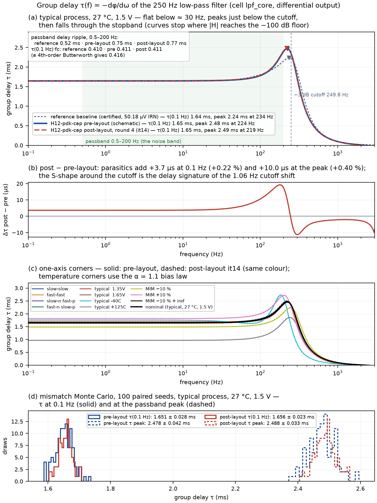

# Group delay — results (H12-pdk-cap, pre- and post-layout)

*Generated 2026-08-16 by `scripts/fig_group_delay.py`; every number below is
re-derivable from `figures/data/group_delay.json` (`--replot`). Group delay is
**report-only** in this repo — no S-line scores it — so nothing here is a
pass/fail claim; it is the delay characterisation a filter paper is expected to
carry.*

**Definition.** τ(f) = −dφ/dω on the differential output `voutp − voutn`, from
the cell's own frozen ac bench at 100 points/decade (`lab.raw.group_delay_s`,
`np.gradient` on the unwrapped phase). The curve is cut where |H| falls below the
−100 dB certificate floor, exactly like the phase certificate: past that the
sampled phase aliases and its derivative is fiction. τ at 0.1 Hz is the dc delay;
"peak" is the passband maximum (f ≤ 1.2 fc); "Δτ 0.5–200 Hz" is the delay ripple
over the noise band, i.e. how far from linear-phase the passband is.

**Sanity anchor.** A 4th-order Butterworth has τ(0)·ω_c = 2.613, i.e.
τ_dc·fc = 0.416. Every 27 °C row below sits at 0.410–0.411 — the merged ladder is
Butterworth-like at dc, and the MIM ±10 % corners keep 0.411 exactly (a pure
frequency scaling), while the temperature extremes (0.370 at −40 °C, 0.304 at
+125 °C) change the *shape*, not only the scale — the same rows that fail S1.

*Figure: (a) τ(f) of the reference baseline, pre-layout and post-layout it14 at
nominal; (b) post − pre; (c) one-axis corners pre (solid) vs post (dashed);
(d) mismatch Monte Carlo of τ(0.1 Hz) and the passband peak, 100 paired seeds.*

## 1. What the numbers say

- **Layout is invisible in delay.** it14's parasitics add **+3.7 µs at dc
  (+0.22 %)** and **+10 µs at the peak (+0.40 %)**, the delay signature of the
  1.06 Hz cutoff shift; the ±10 µs S-shape in (b) sits at the cutoff. Against
  the mismatch spread (σ ≈ 28 µs at dc, ≈ 40 µs at the peak) the layout shift is
  0.13 σ / 0.25 σ — well below one mismatch sigma.
- **Cell vs reference.** dc delay is the same (1.65 vs 1.64 ms, both ≈ 0.41/fc),
  but H12-pdk-cap peaks higher (2.48 vs 2.24 ms) with **0.75 ms** of passband
  delay ripple against the reference's **0.52 ms** — its second biquad has the
  higher Q (the sharper knee that buys the −49 dB stopband is paid in delay
  ripple). Neither is specced; it is the trade a reader should see.
- **Corners scale, they do not distort — except temperature.** Process corners
  move τ_dc by ±1 % (ss 1.664 / ff 1.628 ms), the MIM corners by ±10 % as
  1/fc, 1.35 V by +2.3 %; −40 °C (+6 %) and +125 °C (−42 %) also flatten/sharpen
  the knee (peak 2.72 / 1.85 ms) — the headroom failures the pre-layout PVT
  study already reports.
- **Post-layout tracks pre-layout at every corner** to within +0.3…+0.5 % of τ,
  including the accepted-miss corner (`cap_bcs` × 0.9 + `iref` × 0.9).
- **Monte Carlo** (100 paired seeds): τ_dc 1.651 ± 0.028 ms pre → 1.656 ± 0.023
  ms post; peak 2.478 ± 0.042 → 2.488 ± 0.033 ms; the post-layout spread is
  slightly *tighter* (the extraction adds fixed C that dilutes the device
  mismatch), consistent with the paired all-pass yield 82 → 87 %.

## 2. Tables

### Nominal group delay (`mos_tt`, 27 °C, 1.5 V; 100 pts/decade)

| DUT | `fc` (Hz) | τ(0.1 Hz) (ms) | τ peak (ms) @ f (Hz) | τ(fc) (ms) | τ(100 Hz) | τ(200 Hz) | Δτ 0.5–200 Hz (ms) | τ_dc·fc | `ph_max` (°) |
|---|---|---|---|---|---|---|---|---|---|
| reference baseline | 250.41 | 1.637 | 2.239 @ 234 | 2.221 | 1.807 | 2.156 | 0.517 | 0.410 | 346.74 |
| pre-layout (schematic) | 249.84 | 1.647 | 2.476 @ 224 | 2.345 | 1.783 | 2.403 | 0.754 | 0.411 | 332.39 |
| post-layout it14 (kpex CC) | 248.78 | 1.651 | 2.486 @ 219 | 2.352 | 1.793 | 2.420 | 0.767 | 0.411 | 331.24 |
| **post − pre (it14)** | -1.06 | +0.0037 | +0.0100 | +0.0077 | +0.0106 | +0.0173 | +0.0137 | -0.0008 | -1.154 |

### Group delay over corners — pre-layout vs post-layout it14

Temperature rows use the α = 1.1 bias law (as `PRELAYOUT.md`); MIM rows use `cornerCAP.lib` sections.

| corner | `fc` pre → post (Hz) | τ(0.1 Hz) pre → post (ms) | τ peak pre → post (ms) | τ(fc) pre → post (ms) | Δτ 0.5–200 Hz pre → post (ms) | S1 pre / post |
|---|---|---|---|---|---|---|
| mos_tt 27C 1.50V (nominal) | 249.8 → 248.8 | 1.647 → 1.651 | 2.476 → 2.486 | 2.345 → 2.352 | 0.754 → 0.767 | PASS / PASS |
| mos_ss +27C 1.50V | 247.5 → 246.5 | 1.664 → 1.669 | 2.495 → 2.506 | 2.368 → 2.376 | 0.763 → 0.777 | PASS / PASS |
| mos_ff +27C 1.50V | 252.6 → 251.5 | 1.628 → 1.631 | 2.446 → 2.456 | 2.316 → 2.324 | 0.731 → 0.745 | PASS / PASS |
| mos_sf +27C 1.50V | 250.0 → 248.9 | 1.642 → 1.646 | 2.464 → 2.474 | 2.333 → 2.341 | 0.750 → 0.762 | PASS / PASS |
| mos_fs +27C 1.50V | 248.9 → 247.9 | 1.656 → 1.660 | 2.470 → 2.480 | 2.351 → 2.359 | 0.737 → 0.751 | PASS / PASS |
| mos_tt +27C 1.35V | 243.8 → 242.4 | 1.685 → 1.690 | 2.470 → 2.496 | 2.371 → 2.386 | 0.703 → 0.736 | FAIL / FAIL |
| mos_tt +27C 1.65V | 250.0 → 248.9 | 1.646 → 1.649 | 2.474 → 2.484 | 2.343 → 2.350 | 0.753 → 0.767 | PASS / PASS |
| mos_tt -40C 1.50V | 211.2 → 210.2 | 1.751 → 1.757 | 2.723 → 2.736 | 2.397 → 2.406 | 1.104 → 1.108 | FAIL / FAIL |
| mos_tt +125C 1.50V | 316.3 → 314.6 | 0.962 → 0.966 | 1.852 → 1.863 | 1.364 → 1.371 | 0.727 → 0.737 | FAIL / FAIL |
| cap_bcs x0.9 | 277.2 → 275.9 | 1.483 → 1.486 | 2.234 → 2.245 | 2.114 → 2.122 | 0.555 → 0.571 | PASS / FAIL |
| cap_wcs x1.1 | 227.4 → 226.5 | 1.811 → 1.815 | 2.718 → 2.728 | 2.575 → 2.583 | 0.905 → 0.913 | PASS / PASS |
| cap_bcs x0.9 + iref x0.9 | 250.6 → 249.4 | 1.638 → 1.643 | 2.449 → 2.460 | 2.326 → 2.334 | 0.731 → 0.747 | PASS / FAIL |

### Mismatch Monte Carlo, n = 100 paired seeds (`mos_tt_mismatch`, 27 °C, 1.5 V; 50 pts/decade scorecard columns)

| DUT | usable | τ(0.1 Hz) mean ± σ (ms) | min / max | τ peak mean ± σ (ms) | min / max | τ(fc) mean ± σ (ms) | `fc` mean ± σ (Hz) |
|---|---|---|---|---|---|---|---|
| pre-layout (schematic) | 100/100 | 1.651 ± 0.028 | 1.587 / 1.737 | 2.478 ± 0.042 | 2.370 / 2.595 | 2.346 ± 0.042 | 249.21 ± 3.76 |
| post-layout it14 (kpex CC) | 100/100 | 1.656 ± 0.023 | 1.603 / 1.708 | 2.488 ± 0.033 | 2.405 / 2.566 | 2.355 ± 0.034 | 248.04 ± 3.06 |

Sources: `figures/data/group_delay.json` (curves, scorecards, MC rows), script `scripts/fig_group_delay.py`; the MC columns are the harness's own soft scorecard columns `gd_dc_ms` / `gd_max_ms` / `gd_fc_ms` (`lab.metrics`, 50 points/decade); the curve tables use the 100 points/decade sweep.
