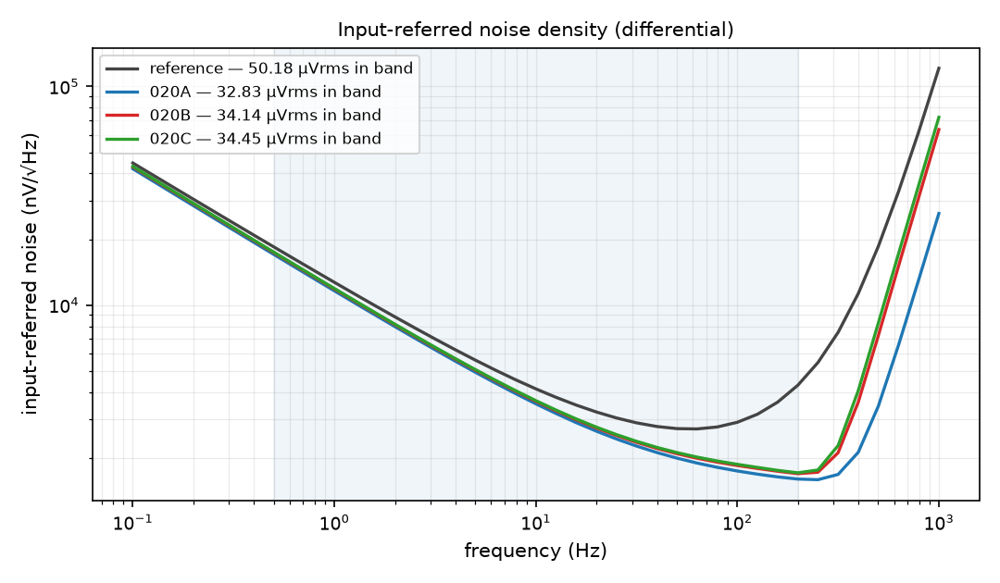
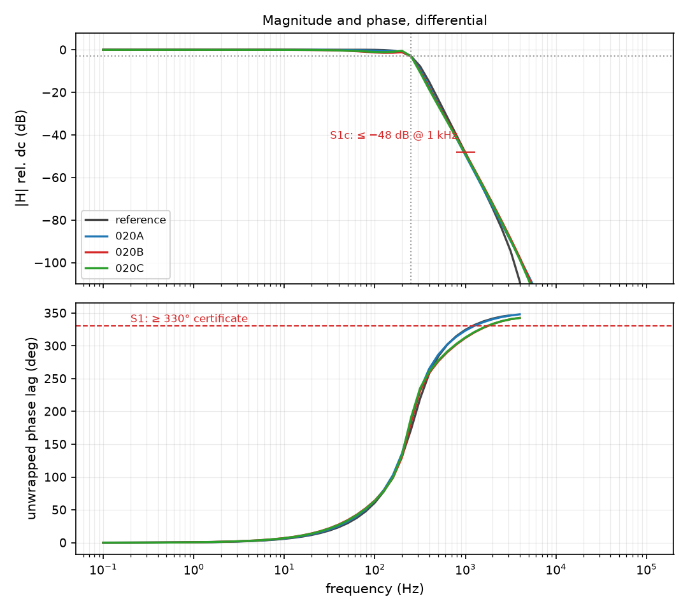
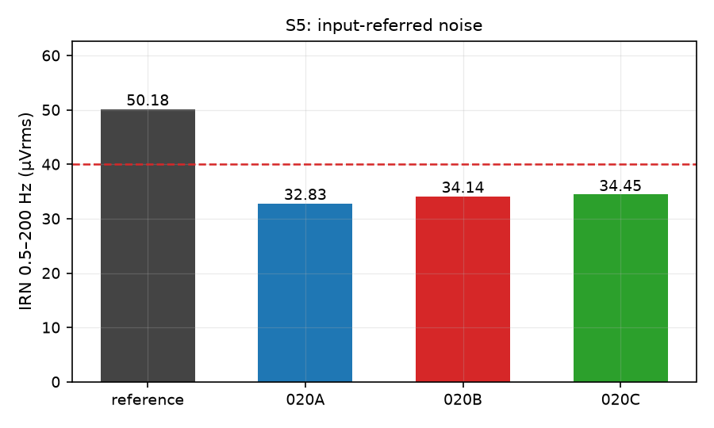
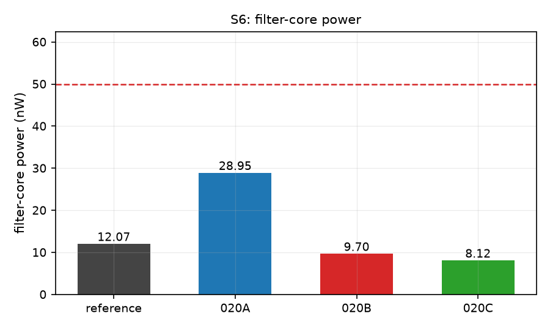
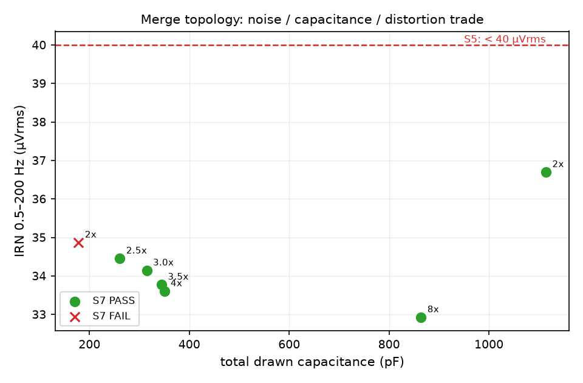
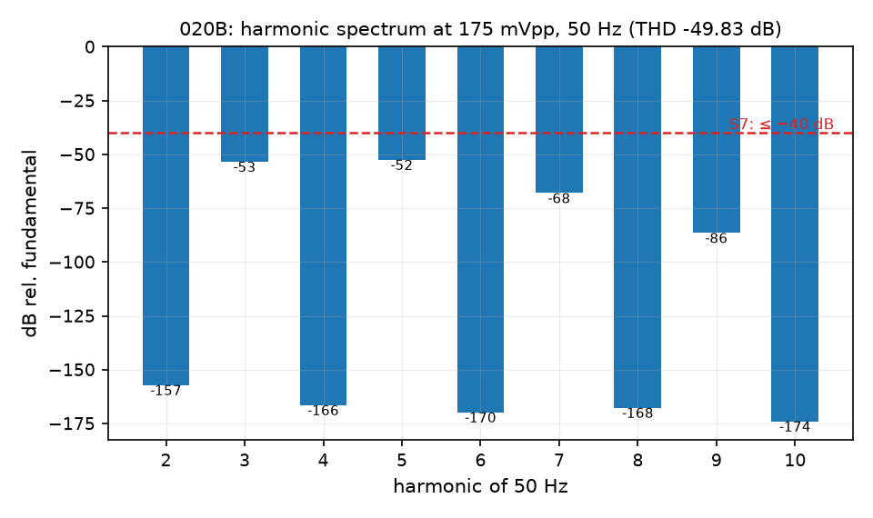

# 020 — the three candidate topologies, ported and sized in SG13G2

**Status: CLOSED 2026-08-11. Three cells, every spec line PASS on all three.**

| | |
|---|---|
| **Paper(s)** | branch stacking (`gmc-compact` + `tian2023`); the gm_f merge (carried forward, new in the originating campaign); cap/Q allocation (`ssf-33mhz`) |
| **Hypothesis** | The three signed-off candidate topologies are technology-independent — their mechanism is *which devices carry signal instead of only bias*, not any property of the silicon — so each should port to SG13G2, re-size, and keep its win over the reference baseline. Falsified if a mechanism turns out to depend on a device property this PDK does not have. |
| **Verdict** | **CONFIRMED — with two forced re-realisations, both measured, neither optional.** All three cells meet S1–S7 simultaneously and every one beats the reference baseline on noise. The mechanism ports; two *implementation* choices in the original drawing do not, because they depend on an isolated NMOS and on a supply the device stack cannot actually spend (§2). |

## 1. Result

Certified by [`certify.py`](certify.py); every number is a ledger row tagged
`cert_*`. Nominal corner, 27 °C, VDD = 1.5 V.

| cell | fc (Hz) | dc (dB) | peak (dB) | @1 kHz (dB) | ph_max (°) | **IRN (µVrms)** | **P (nW)** | **THD (dB)** | C (pF) |
|---|---|---|---|---|---|---|---|---|---|
| reference | 250.00 | −0.0047 | 0.023 | −48.43 | 346.43 | 50.18 | 12.07 | −48.37 | 98.0 |
| **020A** | 250.00 | −0.0120 | 0.000 | −49.49 | 347.98 | **32.83** | 28.95 | −43.51 | 747.8 |
| **020B** | 250.00 | −0.0112 | 0.000 | −48.54 | 342.56 | **34.14** | **9.70** | **−49.83** | 314.6 |
| **020C** | 250.00 | −0.0112 | 0.000 | −48.97 | 342.43 | **34.45** | **8.12** | −41.42 | 260.9 |
| *spec* | 250 ±2 % | ≤ 0.2 | ≤ 0.2 | ≤ −48 | ≥ 330 | **< 40** | **< 50** | **≤ −40** | *report* |

**All three cells: 8 of 8 spec lines PASS.** Against the reference baseline:

| cell | IRN | power | capacitance |
|---|---|---|---|
| 020A | **−34.6 %** | +139.9 % | +663 % |
| 020B | **−32.0 %** | **−19.6 %** | +221 % |
| 020C | **−31.3 %** | **−32.7 %** | +166 % |

The noise figure is the whole story in one frame: the three candidates sit on
top of each other and a clear distance below the reference from ~2 Hz upward.
That is exactly where the reference's eight dedicated bias current sources
dominate — the candidates delete four to six of them by making the same amperes
do signal work, and the gap is what that deletion is worth.

 

## 2. What did not port, and what it cost

### 2.1 The n-type input follower (S3)

The originating cells alternate an n-type input follower with a p-type one, so
the two |Vgs| level shifts cancel. SG13G2 has **no deep-n-well NMOS**, so an
n-type follower's bulk is the shared substrate, and a gate-driven follower with
bulk at the rail has dc gain of exactly **1/n** in weak inversion
(gmb = (n−1)·gm, n ≈ 1.38). Measured on the faithful redraw:

| stage | follower | dc gain |
|---|---|---|
| A | n-type, bulk at substrate | **−3.111 dB** |
| B | p-type, bulk at its own source | **−0.007 dB** |

−3.1 dB against an S3 box of ±0.2 dB, and **no re-sizing recovers it** — 1/n is
a process constant. Every signal-path follower here is therefore p-type.
([journal/nmos-bulk-tie.md](../../doc/journal/nmos-bulk-tie.md))

### 2.2 The rail-tied bridge gate (S3, S4, and the whole dc ladder)

The originating bridge is a common-gate cascode with its gate hard-tied to the
rail. That makes the ladder current the solution of

    |Vsg|(gmf_b) + |Vsg|(bridge) = VDD

At 1.5 V two nano-amp-biased p-devices want ≈ 0.95 V between them, not 1.5 V, so
the equation forces both ~0.29 V up their exponentials — 7.3 e-folds, i.e. ~1500×
less W/L each. Measured consequence on the faithful redraw:

| | bridge \|Vds\| | bridge gm/gds | gmf_b gm/ID | dc gain |
|---|---|---|---|---|
| gate at the rail | **46 mV** | **1** | 14.4 | −2.17 dB |
| gate at the bias reference | **283 mV** | **3158** | 24.8 | **−0.011 dB** |

The bridge was simply in **triode**, and a triode bridge couples the two
internal nodes the topology assumes are isolated. Biasing its gate from the
mirror fixes it — and makes the ladder current *mirror-referenced* instead of
threshold-referenced, which is precisely the fix the originating campaign
itself named as the required next step for this family.

## 3. What the three cells are

All three are branch-stacked: both input followers sit in ONE dc branch through
the bridge, so the same ampere does the gm work of both and **both
internal-node bias pairs are deleted**. The ladder, measured on 020B:

    VDD 1500 → voutp 1220 → net4 972 → vout_1 687 → net2 415 → 0 mV

| cell | structural difference | what it isolates |
|---|---|---|
| **020A** | biquad B's output keeps **two** p-devices: a dedicated bias source *and* a separate shunt-feedback transconductor | branch stacking **alone** |
| **020B** | the two are **merged** into one device — the same current is bias *and* in-loop signal, so the last large pure-bias pair leaves the noise ledger | branch stacking **+ the merge** |
| **020C** | 020B re-sized under a minimum-power/area ruling | what the merge's margin can be spent on |

**020A vs 020B is the measurement of what the merge is worth**, at matched noise:

| | 020A (stacking only) | 020B (+ merge) | merge buys |
|---|---|---|---|
| IRN | 32.83 µVrms | 34.14 µVrms | −1.31 µV worse |
| filter-core power | 28.95 nW | **9.70 nW** | **−66 %** |
| total drawn C | 747.8 pF | **314.6 pF** | **−58 %** |
| THD @ 50 Hz | −43.51 dB | **−49.83 dB** | **+6.3 dB** |

For 4 % of the noise, the merge returns two thirds of the power, well over half
the capacitance, and 6 dB of distortion margin. That is a bigger win than the
originating campaign's own figure for the merge, and in the same direction.

## 4. The trade that sets every cell's sizing

Distortion, not noise, is what costs area here. Raising the ladder current
improves THD; holding fc at 250 Hz while raising the current requires
capacitance in proportion. The sweep (12 sizing points, each shape-fitted and
then THD-measured):

| ladder scale | IRN (µV) | P (nW) | C (pF) | THD (dB) |
|---|---|---|---|---|
| 2.0× | 34.87 | 6.54 | 178.2 | −29.47 **FAIL** |
| 2.5× | 34.45 | 8.12 | 260.9 | −41.42 PASS ← **020C** |
| 3.0× | 34.14 | 9.70 | 314.6 | **−49.83** PASS ← **020B** |
| 3.5× | 33.77 | 11.29 | 344.3 | −41.40 PASS |
| 4.0× | 33.60 | 12.88 | 349.8 | −44.30 PASS |
| 8.0× | 32.92 | 25.70 | 864.1 | −42.12 PASS |

Two things worth reading off it. **Noise saturates** — 4× more power buys 1.3 µV,
because past ~3× the ladder the residual is flicker and the bias devices are
already gone. And **THD is not monotone** in the ladder current: it peaks sharply
at 3.0×. That is real, not measurement scatter — the instrument reproduces
−49.83 / −49.84 / −49.83 dB across 20/30/40 cycles and 512/1024 points per cycle.
The mechanism (an operating-point resonance between the ladder and the pole
allocation the shape fit lands on) is **not yet explained**, and it is the one
result here that should not be trusted outside the points actually measured.

Every cell is HD3-dominated with HD2 at −144 to −157 dB, i.e. the differential
balance holds and the distortion is a genuine odd-order mechanism rather than an
asymmetry artefact.

## 5. Honest limits

- **Nominal corner only.** No PVT, no mismatch/Monte-Carlo, no supply droop.
  Every PASS above is a nominal PASS.
- **Capacitance is large** — 261–748 pF against the reference's 98 pF. It is a
  reported cost, not a spec line, but at ~1.5 fF/µm² of MIM it dominates die
  area and it is the honest price of S7 in this technology.
- **S8 is not claimed.** These are ported topologies; the ≥ 2-paper combination
  is the originating campaign's provenance, and re-establishing it against
  `pdf/INDEX.md` in this PDK's terms is unfinished work.
- **The THD non-monotonicity is unexplained** (§4).
- The 3.5× and 4.0× points sit ~8 dB below the 3.0× point on THD for no reason
  the operating-point tables reveal; treat the sizing as a measured lookup, not
  as a model.

## 6. Files

| path | what |
|---|---|
| [`frozen/`](frozen/) | the three certified sizing points, as JSON |
| `cand_a/scorecard.md`, `cand_b/`, `cand_c/` | per-cell sign-off: spec verdict, bias sheet, geometry, distortion |
| [`certify.py`](certify.py) | regenerates every scorecard, testbench and figure from `frozen/` |
| [`sizes.py`](sizes.py) | starting sizing points |
| `../../decks/020a,020b,020c/` | the frozen testbench + build sheet per cell |
| `../../lab/dut.py` | the topologies themselves (`build_a`, `build_b`, `build_c`) |
