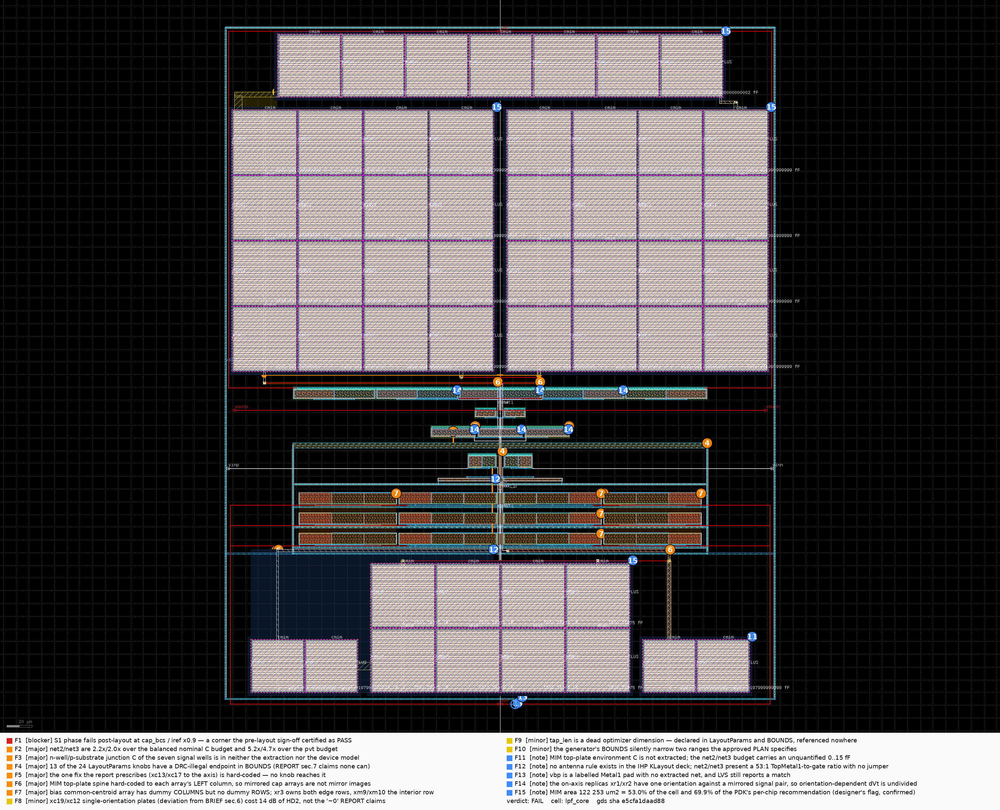

# Layout review — `H12-pdk-cap` (`lpf_core`), IHP SG13G2

**KIND: INDEPENDENT REVIEW.** Nothing below is taken from `REPORT.md`. The GDS was rebuilt
from the committed generator, DRC / LVS / PEX (CC **and** RC) were re-run through the platform
wrappers, and every metric was re-measured on the block's own frozen benches. Per-finding zooms
are in [`review_crops/`](review_crops/); the machine-readable form is
[`REVIEW.yaml`](REVIEW.yaml) (`layout-review/1`, `validate-review` → ok).

| | |
|---|---|
| reviewed GDS | rebuilt by the reviewer, sha256 `e5cfa1daad8818248f2695ac22b18d633d7723edd71cd2f4f0d76bc888786a9c` — **identical to the designer's claim** |
| generator | `layout/H12-pdk-cap/gen_H12_pdk_cap.py`, default `LayoutParams` (no knob moved) |
| certified netlist of record | `signoff/post-pvt/H12-pdk-cap/asbuilt/core.sp`, sha256 `ef78d6f8d4e28cfbf18dc7abf6bd4066070fdf9f63546d430f16c4d71ffaf3c7` |
| netlist LVS actually compared against | `layout/H12-pdk-cap/asbuilt/core_lvs.sp`, sha256 `4ce3177c16c239c33c04d3f41c3f705a41b2a400e808b84c72160059fba0f4a5` (provenance re-derived below) |
| PEX modes run by the reviewer | kpex 2.5D **CC** (78 C / 0 R) **and RC** (78 C / 6 233 R) |
| symmetry axis | x = 0 |
| **verdict** | **FAIL** |

## Findings

| # | sev | where (net / device / rule) | evidence (number, file:line, XOR area) | effect (metric, how much, model) | fix → generator parameter | expected magnitude |
|---|---|---|---|---|---|---|
| **F1** | **blocker** | `net2`/`net3` TopMetal1 hauls; whole cell (objective) | reviewer re-run at `LPF_CAP_CORNER=cap_bcs`, `iref ×0.9`: **ph_max = 329.299° < 330°, S1 violated**. Same corner pre-layout = 331.021° **PASS** (`PRELAYOUT.md` §5). Nominal post-layout margin 0.732° vs the 1.00° pvt margin `brief.json` was built on. `REPORT.md` §6 predicts this and runs no corner. | ph_max **−1.722°** at that corner (measured, both DUTs through `lab.metrics.evaluate`) | **new feature** — `xc13`/`xc17` sub-arrays on the axis (`xc19` outboard). No knob reaches it (F5). Measured knob-only best: `cc13_cols=1` → 329.444°, still FAIL | net2/net3 ≤ ~19.6 fF for a bare pass; ≤ 9.6 fF (brief pvt budget) measured at **330.237° PASS** |
| **F2** | major | `net2` 50.04 fF, `net3` 44.94 fF (budget) | kpex CC on the rebuilt GDS, C to the bench ac grounds: 50.04 / 44.94 fF vs `brief.json` 22.8 nominal / 9.59 pvt = **2.19×/1.97× and 5.22×/4.69×**. Dominant term: the 170.5 µm TopMetal1 haul `x −175.685 → −5.15` at a measured **0.116 fF/µm** (kpex ihp tech: 5.649 aF/µm² area + 2×37.383 aF/µm perimeter = 84 aF/µm) | ph_max **−1.117°** (delete-the-parasitic what-if; reproduces the designer's 1.117) | **`cc13_cols` 2 → 1** (free: identical area, DRC 0) | net2 50.04 → **42.52 fF**, net3 → 42.11, ph_max 330.732 → **330.872** (measured) |
| **F3** | major | n-well islands of `net4`/`net1` (327.20 µm² each) | kpex's `ihp-sg13g2_tech.pb.json` lists `NWell` **only** as an overlap/side-overlap *bottom* layer — there is no NWell↔substrate term; the PSP model's junction C uses `AS/AD/PS/PD` only. So the well/substrate junction of the **seven signal wells** is in neither. At 0.05–0.12 fF/µm² and 0.93 V that is **16–39 fF per half on net4/net1**, on top of the extracted 77.30 / 67.27 fF against an 82.8 fF nominal budget | ph_max **−0.12…−0.28°** more than reported (**hand model**, not a measurement) | **new feature** — add a well-junction term to the post-layout splice, or shrink `xmst`/`xmstn`. Wells are already at the NW.c floor (`well_margin = 0.62`) | net4/net1 true load ≈ 93–116 fF vs an 82.8 fF budget; nominal ph_max ≈ 330.45–330.61, not 330.732 |
| **F4** | major | `LayoutParams` / `BOUNDS` (knob) | reviewer built **+ DRC'd all 24 knobs at both endpoints (48 builds)**: **13 endpoints are DRC-dirty** — `bias_dummy_cols=2` → 330 (Cnt.j 278, pSD.i 24, Cnt.f 12, Cnt.d 10, Gat.f 6); `ring_w=3.0` → 132; `gmfb_dummy=2` → 80; `bank_gap=6.0` → 13; `row_gap=3.0` → 12; `w_m2=1.0` → 12 (M2.b); `dev_gap_x=1.0` → 6 (TGO.e @ ±79.71, 148.22); `axis_gap=2.0` → 2 (M1.b); `cap_bank_gap=4.0`, `cc19_cols=1`, `cc1_cols=16`, `via_pad=4.0` → 2 each; `ring_gap=15.0` → 1. `REPORT.md` §7 claims "no legal knob value can produce a violation" | **13 of 48** BOUNDS endpoints illegal; five of them are a knob's declared **minimum** (what-if) | **`BOUNDS`** — tighten to the measured legal ranges, or clamp inside `build()` the way the pmos pitch already is | 48/48 endpoints build DRC-clean; 35/48 do today |
| **F5** | major | bank A order: `xc19` @ x=0, `xc13`/`xc17` outboard (knob) | `build()` places `a19` at `xc=0.0` and `a13`/`a17` at `±(a19.x0 − cap_bank_gap − w13/2)`; nothing in `LayoutParams` swaps bank order. Reviewer built + extracted every plausible alternative: `cc19_cols=2` → net2 **53.88 fF (worse)** at +19 % area; `cc19_cols=2 + cc13_cols=1` → 46.33 fF at +19 % area; `cc13_cols=1` → 42.52 fF at unchanged area | best knob-only gain **+0.14°** of the 0.56° needed (what-if) | **new feature** — a `bankA_order` / "which sub-array is on the axis" knob (`PLAN` §8 lists this floorplan as rejectable, so it should be a knob) | haul 170.5 µm → ~60 µm ⇒ −13 fF ⇒ **+0.34°** |
| **F6** | major | MIM top-plate spine, all six arrays (symmetry / routing) | `cap_array()`: `x_spine = x0 + side/2` **regardless of half**. Measured: `net4` Metal3 haul −186.085→−1.710 = **184.4 µm** vs `net1` 1.710→31.555 = **29.8 µm** (Δ 154.6); `net2` TopMetal1 −175.685→−5.15 = **170.5 µm** vs `net3` **128.4 µm** (Δ 42.1). Mirror-XOR about x=0: **Metal3 126.35 µm² (13.1 % of all Metal3)**, TopMetal1 847.05, Metal5 948.78, Metal1 47.56, Metal2 24.0, Metal4 24.0 — while **Activ / GatPoly / Cont / ThickGateOx / NWell / pSD / nSD / MIM / Vmim XOR = exactly 0** | Δ(net2,net3) **5.10 fF**, Δ(net4,net1) **10.04 fF** (what-if); inside the one-sided budgets 45.7/19.2 and 166/69.5 but all of it on the tightest net | **new feature** — one line: spine at `x0+side/2` on the left half, `x1−side/2` on the right | Δ(net2,net3) < 0.5 fF, net2 −5 fF ⇒ **+0.13°**; `cc13_cols=1` already collapses Δ to 0.41 fF |
| **F7** | major | bias common-centroid array, rows y = 116.94 / 132.84 / 148.74 (matching) | rows read back from the GDS + per-net shapes: **y=116.94 and y=148.74 are `vbr` (the four `xr3` units), y=132.84 is `net2`/`net3` (`xm9`/`xm10`)**. `LayoutParams` has `bias_dummy_cols` but **no `bias_dummy_rows`** — the array's top/bottom neighbours are the tap bar and the `gmf_a` row. Centroids do coincide (linear gradients cancel), but the numerator of the tightest ratio sits entirely on **edge** rows and the denominator on the **interior** row | exposure **1.2 Hz of fc** at the tolerated 0.346 mV (3.51 Hz/mV, `brief.json` `rep_sink_ratio`) against a 3.27 Hz post-layout margin — **hand model, magnitude is a bound, not a measurement** | **new feature** — `bias_dummy_rows ≥ 1`, or a 2×3 array so both classes share edge status | every array member gets a dummy on four sides; edge/interior status equal for numerator and denominator |
| **F8** | minor | `xc19`, `xc12` plate assignment (symmetry) | reviewer what-if on `core_pex.sp`: replacing every C on a mirror pair by the pair mean — **outputs only** (`vout_1↔vout_2`, `voutp↔voutn`) moves HD2 **−88.06 → −98.38 dB**; all pairs → **−102.29 dB**; **internals only** → −87.16 dB (i.e. *none* of the HD2 rise comes from net2/net3/net4/net1, and none needs the "single-ended xr1/xr2 drain columns" `REPORT` §5 also blames). Imbalance: vout_1 231.73 vs vout_2 75.93 fF (Δ 155.80); voutp 505.50 vs voutn 352.55 (Δ 152.95) | HD2 **+14.2 dB** worse than symmetric (what-if). THD unchanged at −49.614 (HD3-dominated); **S7 keeps 9.6 dB** | **new feature** — the BRIEF §6 anti-oriented 4+4 / 4+3 split; `write_lvs_reference` already emits a swapped-terminal card for `xc1`/`xc10` | HD2 back to ≈ −102 dB; Δ(vout_1,vout_2) and Δ(voutp,voutn) < 20 fF. `PLAN` §8.3's "benefit ≈ 0" is contradicted |
| **F9** | minor | `tap_len` (knob) | `p.tap_len` occurs **0 times** in `build()` (field commented "(reserved)"). Builds at `tap_len=1.0` and `tap_len=20.0` are **byte-identical to the default** (`e5cfa1da…86a9c`) | one wasted optimizer dimension (what-if) | **`tap_len`** — remove from `LayoutParams` + `BOUNDS`, or implement it | every `LayoutParams` field changes the GDS |
| **F10** | minor | `w_m1`, `w_m2` (knob) | approved `PLAN` §5: `w_m1` 0.14–1.0, `w_m2` 0.16–1.0. Generator `BOUNDS`: `w_m1 (0.16, 1.0)`, `w_m2 (0.20, 1.0)`. `REPORT` §7 reprints the generator's values, so the divergence is invisible unless the PLAN is re-read | none electrically; contract drift (hand) | **`BOUNDS`** — reconcile with `PLAN` §5 or amend the PLAN | PLAN §5 and BOUNDS agree field by field |
| **F11** | note | `xc13`/`xc17` top plates (pex) | kpex 0.3.12 cannot run on a `cap_cmim` (its ihp tech names `cmim_top` `"<TODO>"`), so extraction runs on the MIM-stripped GDS and the top plates are absent. `net2`/`net3` each carry **3 285.4 µm² of TopMetal1 top plate**. `REPORT` §4/§9 bound the omission at ≤ 15 fF (net2/net3) / ≤ 91 fF (net4/net1) with a patched-tech run, both stated as over-counts. The reviewer reproduced the stripped flow exactly but **could not close the bound** | up to **+15 fF on net2/net3** (hand) — the same order as the 22.8 fF budget itself | **new feature** — MIM-aware kpex tech, or `tech_json=` on `run_pex` (already `REPORT` Next-Steps #4) | an extraction that keeps the top plates without the `<TODO>` crash |
| **F12** | note | `net2`/`net3` gate lines (leakage / antenna) | the executed deck (35 tables + `sg13g2_maximal`) contains **no antenna rule table**, so DRC cannot flag it. Measured: net2 TopMetal1 area **3 587.97 µm²** driving `xm4`'s poly gate (1.5 × 45 = 67.5 µm²) → ratio **≈ 53:1**, no jumper available (the haul *is* the top metal) and a diode is forbidden by BRIEF §3 (6.17 pA) | antenna ratio 53 (hand) | **new feature** — break the gate line with a lower-metal segment, or hand to a chip-level antenna check | a documented antenna number for net2/net3 before tape-out |
| **F13** | note | `vbp` pad at (10, −10)…(14, −8) (lvs) | `lvs/lpf_core_extracted.cir` has **15 nets and no `vbp`**; the certified header has 8 pins; LVS still reports **matched**. Intended (BRIEF §9), and the mirror-XOR flags the pad as the only Metal1 asymmetry (8.0 µm²) | 1 of 8 pins unchecked (hand) | **new feature** (platform) — assert the extracted pin set against the certified header inside `run_lvs` | a pin-list assertion in the LVS verdict |
| **F14** | note | `xr1` (−31.53…31.53, y 231.75), `xr2` (−16.84…16.84, y 202.01) (matching) | `b.mos()` mirrors only `sign>0`, so every pair is one mirrored + one not, while `xr1`/`xr2` are drawn `sign=−1` only. The **bias array is orientation-balanced** (xr3 = 2+2, xm9/xm10 = 1+1); **gmf_b and bridge are not** (xr1 = 1 unmirrored vs xm14/xm15 = 1+1) | 0.8 Hz of fc per mV of orientation-dependent ΔV_T (1.56 Hz/mV; tolerance 0.838 / 0.835 mV) — hand | **new feature** — mirror the placement, not the device, on the replica rows | the replica ratio's orientation term cancelled or measured |
| **F15** | note | all six MIM banks (other) | merged MIM (36/0) = **122 253.49 µm²** in 51 units; cell 432.48 × 533.26 = 230 624.28 µm² → **53.0 % of the cell**, **69.9 %** of the PDK's 174 800 µm²/chip recommendation. `MIM.gR` **is** in the executed deck and does not fire. Confirms `REPORT` §1 | area/architecture flag (hand) | block-level decision — total C is set by `design.json`, not by layout | block owner acknowledges before a second instance is placed |

## What reproduced

Everything the designer claimed at the nominal corner reproduced, most of it exactly.

| gate | designer | reviewer | |
|---|---|---|---|
| GDS sha256 | `e5cfa1da…86a9c` | `e5cfa1da…86a9c`, two independent builds | **match**, deterministic |
| outline / area | 432.5 × 533.3 µm, 0.2306 mm² | (−216.24, −10.00)…(216.24, 523.26) = 432.48 × 533.26 = 230 624.28 µm² | match |
| DRC | 0, **no waivers** | **0 violations**, PDK KLayout deck (35 tables + `sg13g2_maximal`) | match. No waiver is claimed and none is needed — nothing to agree or disagree with |
| LVS | match | **matched** against `asbuilt/core_lvs.sp` sha `4ce3177c…f4a5` | match |
| LVS reference *provenance* | "`to_lvs_reference(core.sp)` + three mechanical edits" | regenerated from the generator → **byte-identical**; diff against `to_lvs_reference(core.sp)` (certified sha `ef78d6f8…af3c7`) shows **exactly** the three declared edits (`0`→`vss` + pin, `xc1`/`xc10` terminal swap, two dummy cards) **and nothing else** | match — the LVS was run against a faithful derivation of the certified netlist, not a stray file |
| PEX CC | 78 C, 0 R | 78 C, 0 R; **64 unique net pairs identical to `asbuilt/core_pex.sp` to < 1e-4 relative** | match |
| PEX RC | 77 C, 6 233 R | **78** C, 6 233 R | match — the 78th is the `VSUBS`↔`0` element the designer merges away |
| scorecard (CC) | fc 248.275 · ph 330.732 · a1000 −49.263 · ripple 0.0232 · peak 0.0206 · dc −0.0081 · IRN 29.195 · P 11.913 · THD −49.614 · HD3 −49.81 · HD2 −88.06 | identical to 3 decimals on the designer's PEX; on the reviewer's own PEX subckt fc 248.292, ph 330.732, THD −49.617 | match |
| scorecard (RC) | fc 248.342, ph 330.732, a1000 −49.254 | fc 248.332, ph 330.732, a1000 −49.255 | match |
| pre-layout yardstick | fc 249.7746, ph 332.3823 | identical to `scorecard.json` | match |
| what-if attribution | net2/net3 = 1.117°, net4/net1 = 0.497°, all C = 332.332 | **331.849 (+1.117), 331.229 (+0.497), 332.332** | match |

**Beyond LVS, checked and correct:** pin names/order match the certified header
(`vinp vinn voutp voutn vbn vbp vdd`, +`vss` in the LVS reference only); every device is
`sg13_hv_*` with ThickGateOx drawn (12 156 µm²); the extracted `W`/`L`/`m` match `design.json`
device for device (bias unit `W=24u L=25u` ×3 fingers, `xr3` folded to `W=96u`, dummies to
`W=144u`/`W=24u`); the MIM units are drawn at `unit − 0.72` so the LVS/PEX `w`/`l` equal the
schematic's (`49.19→49.91`, `48.70→49.42`, `47.73→48.45`, `39.81→40.53`), 51 units in four
variants. **The `xc1`/`xc10` plate flip is real, not just a paper edit**: the extractor writes
`C$65 net4 voutp` / `C$66 net1 voutn` (top, bottom) and the extraction puts **492.98 / 346.75 fF**
of plate-to-substrate on `voutp`/`voutn` and only 67.26 / 58.43 fF on `net4`/`net1`.
**Wells:** exactly **8 n-well islands, every one tapped, on the right nets** (vout_1, vout_2,
net4, rep_x, net1, voutp, voutn, vdd), `net4`/`net1`/`rep_x` wells identical at 327.20 µm² with
a 2.0 µm gap ≥ NW.b1, no floating well, no ring on a signal well, substrate taps under every
nmos row. **Layer discipline:** **no net has Metal1 over foreign Activ** (net2, net3, net4,
net1, vbr, rep_x, vout_1, vout_2, voutp, voutn all measure 0.000 µm²); Metal4 exists only as
36 µm² of via-stack pads; `net2`/`net3` carry no diffusion beyond their own drains (8.8 µm²)
and no n-well, so the 6.17 pA leakage rule holds. **The headline constraint is met exactly:**
C(net2 ∪ net3, net4 ∪ net1 ∪ voutp ∪ voutn) = **0.0000 fF** — not small, *absent*: there is no
such element in the netlist, against a 0.277 fF budget.

**Extraction-driven budget (kpex CC, reviewer's own run):**

| net | used to ac gnd | allowed nom / pvt | ratio | one-sided Δ | allowed asym nom / pvt |
|---|---|---|---|---|---|
| `net2` | **50.04** | 22.8 / 9.59 | **2.19× / 5.22×** | Δ(net2,net3) = 5.10 | 45.7 / 19.2 ✓ |
| `net3` | **44.94** | 22.8 / 9.59 | **1.97× / 4.69×** | " | " |
| `net4` | 77.30 | 82.8 / 34.8 | 0.93× / **2.22×** | Δ(net4,net1) = 10.04 | 166 / 69.5 ✓ |
| `net1` | 67.27 | 82.8 / 34.8 | 0.81× / **1.93×** | " | " |
| `vout_1` | 231.73 | 3350 | 0.07× | Δ = 155.80 | 6710 ✓ |
| `vout_2` | 75.93 | 3350 | 0.02× | " | " |
| `voutp` | 505.50 | 905 / 455 | 0.56× / **1.11×** | Δ = 152.95 | 1800 / 905 ✓ |
| `voutn` | 352.55 | 905 / 455 | 0.39× / 0.77× | " | " |
| A↔B coupling | **0.0000** | 0.277 / 0.116 | — | — | — |

**Hand model validated before prescribing:** net2/net3 average 47.5 fF/half × −0.0261 °/fF =
−1.24° vs the measured −1.117° (11 % high); net4/net1 average 72.3 fF × −0.00719 = −0.52° vs
the measured −0.497° (5 % high). The model is good to ~10 %, which is why F1's prescription is
quoted from measured what-ifs rather than from the slope.

**Corners — the gate `REPORT.md` §6 named and did not run** (9-point `lab.corners.AXES`, both
DUTs, `LPF_BIAS_ALPHA=1.1`, plus the five `cornerCAP.lib` points):

| corner | pre ph_max | post ph_max | pre | post |
|---|---|---|---|---|
| mos_tt 27 °C 1.50 V | 332.38 | 330.73 | PASS | PASS |
| mos_ss / ff / sf / fs 27 °C | 332.38 / 332.17 / 332.25 / 332.44 | 330.73 / **330.53** / 330.59 / 330.81 | PASS | PASS |
| mos_tt 27 °C 1.65 V | 332.42 | 330.77 | PASS | PASS |
| mos_tt 1.35 V / −40 °C / +125 °C | 308.01 / 251.67 / 256.03 | 307.26 / 250.10 / 254.93 | FAIL | FAIL (unchanged, headroom) |
| `cap_typ` ×1.0 | 332.38 | 330.73 | PASS | PASS |
| **`cap_bcs` ×0.9 (the pre-layout worst PASSING corner)** | **331.02** | **329.30** | **PASS** | **FAIL — S1** |
| `cap_wcs` ×1.1 | 333.56 | 331.97 | PASS | PASS |

## What I could not check

* **MIM top-plate environment capacitance** — kpex's `cmim_top` is `"<TODO>"` in its IHP tech and
  crashes the 2.5D engine, so extraction necessarily runs on the MIM-stripped GDS (F11).
* **N-well/p-substrate junction capacitance** — no term for it in kpex's tech and none in the PSP
  device cards. F3 is a hand estimate; nothing here measures it.
* **Antenna ratios** — the IHP KLayout deck ships no antenna rule table (F12).
* **Post-layout mismatch Monte Carlo** (pre-layout: 82 % all-pass, THD σ 0.80 dB) — not re-run; F7
  and F14 are precisely the classes an MC would price.
* **The full 45-point PVT grid post-layout** — I ran the 9-point `AXES` set plus the 5 cap corners.
* **Magic DRC / netgen LVS second opinion.**
* Fill/density and sealring are absent by `PLAN` §6, so the pre- and post-layout numbers are
  equally fill-free and the comparison is consistent — but a chip-level fill will move the budget.

## Verdict — **FAIL**

Not because the cell is badly drawn — it is a genuinely careful layout: byte-reproducible, DRC
clean with no waivers, LVS clean against a faithful derivation of the certified netlist, every
device / well / tap / MIM unit **exactly** mirror-symmetric (XOR = 0 on nine physical layers),
and the one constraint the brief called a topology hazard is met with *zero* extracted elements.
It fails on one measured fact and two structural ones:

1. **F1 — a certified corner is broken.** `cap_bcs` with the `iref ×0.9` trim was a **PASS** row in
   the pre-layout sign-off (331.02°); post-layout it is **329.30°** against an S1 limit of 330°.
   The report predicted this and did not measure it; I did. This is not "close" — it is the corner
   the pvt margin was defined on.
2. **F2/F5 — the cause is a 170 µm TopMetal1 haul, and the fix is not reachable.** `net2`/`net3`
   are 2.2× over their balanced budget and 5.2× over the pvt budget; the only lever that closes it
   (moving `xc13`/`xc17` to the axis) is hard-coded, and every knob-only alternative I built and
   extracted either helps by 0.14° or makes it worse.
3. **F3 — a term of the same size as the remaining margin is missing from the scorecard.** The
   n-well junction capacitance of the `net4`/`net1` wells (16–39 fF per half) is in neither the
   extractor nor the device model, so the reported 330.732° is optimistic by an estimated
   0.12–0.28° before any corner is applied.

F4 (13 of 48 `BOUNDS` endpoints DRC-illegal, against an explicit report claim to the contrary) and
F7 (no dummy rows on the cell's tightest matching array) must be fixed before this generator is
handed to an optimizer, but they are not what makes this a FAIL.

— `layout-reviewer`, 2026-08-15. Findings, anchors and reproduction data: `REVIEW.yaml`; zooms: `review_crops/`.
