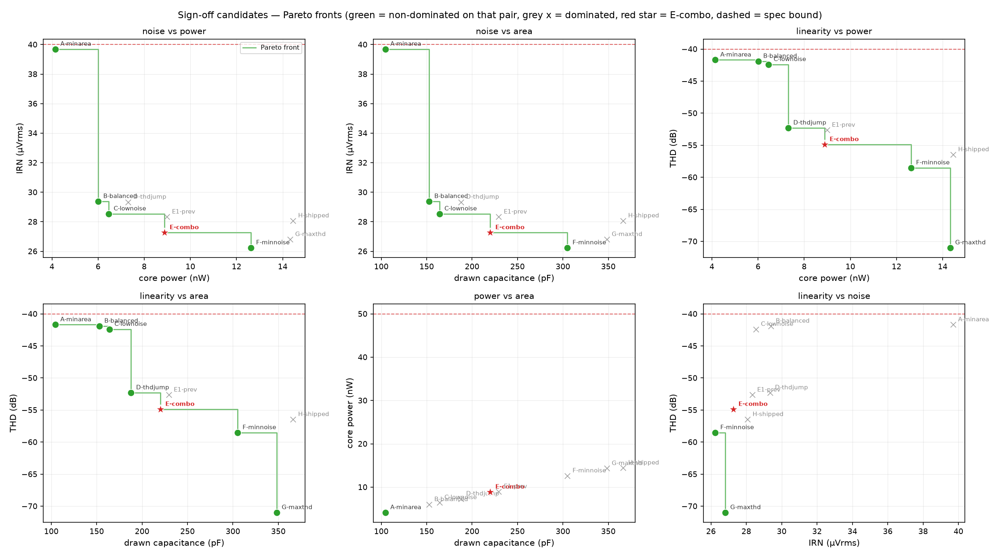
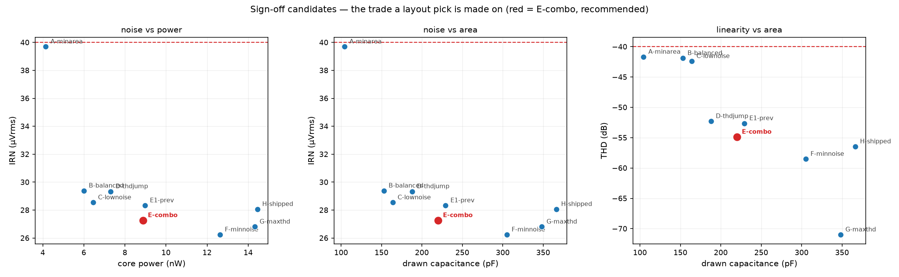
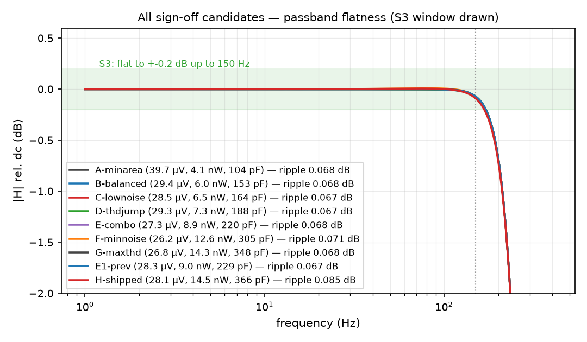
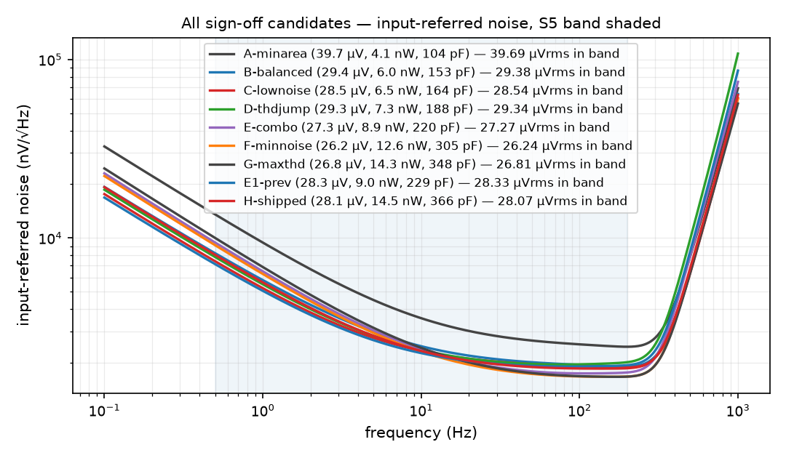

# Sign-off candidates — comparison

**KIND: SIGN-OFF.** Nine sizings of the **same topology** (branch-stacked SSF,
bridge and current reuse intact). They differ only in device sizes, device
flavours and capacitor values. Every one **passes all nine spec lines**, and
every one has been through both identity gates: its schematic netlists to its
as-built netlist, and that netlist simulates to the numbers below.

Ranked by the stated priority: **noise, power and capacitance first, THD
second** — subject to the response still being a flat low-pass.

| cell | IRN µV | P nW | C pF | THD dB | ph° | fc Hz | ripple | peak | `mono_db` | vicm |
|---|---|---|---|---|---|---|---|---|---|---|
| [**`A-minarea`](A-minarea/) | **39.70** | **4.15** | **104.4** | -41.69 | 339.8 | 249.86 | 0.0545 | +0.0000 | 0.0000 | 0.2 |
| [**`B-balanced`](B-balanced/) | **29.38** | **6.01** | **152.9** | -41.90 | 332.2 | 249.85 | 0.0545 | +0.0000 | 0.0000 | 0.65 |
| [**`C-lownoise`](C-lownoise/) | **28.54** | **6.46** | **164.0** | -42.39 | 332.8 | 249.85 | 0.0538 | +0.0000 | 0.0000 | 0.65 |
| [**`D-thdjump`](D-thdjump/) | **29.34** | **7.31** | **187.9** | -52.29 | 331.6 | 249.86 | 0.0532 | +0.0000 | 0.0000 | 0.65 |
| [**`E-combo`](E-combo/) | **27.27** | **8.88** | **220.0** | -54.88 | 334.6 | 249.87 | 0.0544 | +0.0016 | 0.0016 | 0.32 |
| [**`F-minnoise`](F-minnoise/) | **26.24** | **12.63** | **305.0** | -58.52 | 336.4 | 249.96 | 0.0556 | +0.0089 | 0.0089 | 0.32 |
| [**`G-maxthd`](G-maxthd/) | **26.81** | **14.32** | **348.2** | -70.98 | 343.5 | 249.88 | 0.0541 | +0.0029 | 0.0029 | 0.32 |
| [**`E1-prev`](E1-prev/) | **28.33** | **8.98** | **229.3** | -52.64 | 333.5 | 249.86 | 0.0532 | +0.0000 | 0.0000 | 0.65 |
| [**`H-shipped`](H-shipped/) | **28.07** | **14.45** | **366.3** | -56.46 | 341.4 | 249.99 | 0.0691 | +0.0068 | 0.0068 | 0.65 |

*spec:* IRN < 40 · P < 50 nW · C reported only · THD ≤ −40 · ph ≥ 330 (ideal-4-pole ceiling **350.5**) · fc 245–255 · ripple ≤ 0.2 · peak ≤ 0.2.

## Plots

### The trade, as Pareto fronts

Green = non-dominated on that axis pair, grey × = dominated by another candidate,
red star = `E-combo`, dashed line = the spec bound. A cell can sit on the front
for one pair and off it for another — which is the information a layout pick
turns on.



### The three panels a pick is usually made on



### Every candidate's passband, on one axis

The flatness claim, checkable by eye: no candidate has a bump, and all nine sit
well inside the ±0.2 dB window.



### Every candidate's input-referred noise



Per-cell plots (passband, Bode, noise density) are in each design's own
directory, embedded in its `README.md`.

## Flat-response check

All nine are maximally flat low-pass responses, not merely inside the bounds.
`mono_db` is the worst *rise* of |H| below the corner — **0 means the response
never climbs anywhere**. The largest value in the set is 0.0089 dB, i.e. ~22×
inside the 0.2 dB flatness bound and ~2 000× below a visible bump. Peaking is
at most +0.0090 dB. Cutoff is within 0.13 Hz of 250 on every cell.

## Which to take to layout

| if you want | take | why |
|---|---|---|
| **the best all-round cell** | **`E-combo`** | 27.27 µV / 8.88 nW / 220.0 pF / −54.88 dB. Strictly better than the originally-shipped cell on **all four** axes. |
| minimum area and power | `A-minarea` | 4.15 nW, 104.4 pF — but only 0.30 µV of S5 margin. A corner marker, not a shipping cell. |
| lowest noise | `F-minnoise` | 26.24 µV, still −58.52 dB THD, for 12.63 nW / 305.0 pF. |
| maximum linearity | `G-maxthd` | −70.99 dB THD — 31 dB of S7 margin — at 26.81 µV. |
| best noise per nanowatt | `B-balanced` | 29.38 µV at 6.01 nW and 152.9 pF. |

`E1-prev` and `H-shipped` are kept for continuity: `H-shipped` was delivered
first and is **dominated** by `E-combo` (better noise, power and capacitance,
within 1.6 dB on THD); `E1-prev` is the single-lever reference.

## How the good cells were found

Two independent levers, and they compose:

1. **`gm_f,a` length ↔ phase vs THD.** The low-power sizing uses a very long
   `gm_f,a`, whose gate–drain capacitance feeds the path that arrests the phase
   lag: measured 320.7° — an S1 fail. Shortening it recovers the phase at
   unchanged power and capacitance, and costs THD (−44.6 → −36.5 dB).
2. **`gm_f,b` flavour ↔ THD.** Moving `gm_f,b` to the lv device with a resized
   ladder recovers the linearity (−42 → −52 dB).

Applying both to the low-power sizing gives `E-combo`, which is why it beats
cells built from either lever alone.

## Per-directory contents

Each `signoff/<cell>/` is self-contained — an expert can open and run it without
reading the rest of the repo:

```
design.json              the sizing of record, with why this cell is here
asbuilt/core.sp          the certified subckt (the sizing source of truth)
asbuilt/core_tb_*.sp     the certified ac+noise and THD decks
lpf_core_<X>.sch/.sym    the schematic, annotation block on the sheet
lpf_tb_<X>.sch           testbench: op + ac + noise, `.control` in the drawing
lpf_tb_<X>_thd.sch       testbench: coherent strobed transient for S7
*.spice                  the netlists xschem produced from those drawings
scorecard.json           the measured numbers + per-line pass/fail
xschemrc                 library path, so xschem opens straight from the dir
```

Run one:

```bash
C=E-combo
docker run --rm -it -v "$PWD/signoff/$C:/sch" -w /sch \
    spicexplorer-spice-base:local xschem --rcfile /sch/xschemrc lpf_tb_E.sch

# or re-run its two gates headless
uv run python scripts/draw_xschem.py check signoff/$C/asbuilt/core.sp signoff/$C --name lpf_core_E
uv run python scripts/draw_xschem.py sim   signoff/$C/asbuilt/core.sp signoff/$C --name lpf_core_E \
    --design signoff/$C/design.json
```

## What none of them fix

Every cell here shares the family's two structural limits, both measured and
both unfixable by sizing (see [`../doc/campaign-report.md`](../doc/campaign-report.md)):

- **No supply-droop margin.** The reuse ladder is threshold-referenced, so
  `dI/I = dVDD/(2·n·U_T)`; holding ±2 % fc over a ±10 % rail would need a device
  slope of ~1.9 V per e-fold against 0.04–0.2 V for real MOS. It needs a
  supply-independent bias, i.e. added components.
- **In-band THD degrades toward the corner.** A follower biquad's internal node
  is a bandpass tap and peaks near fc. The reference does this too; the stacked
  cells do it more, because one shared ladder current serves both taps.
