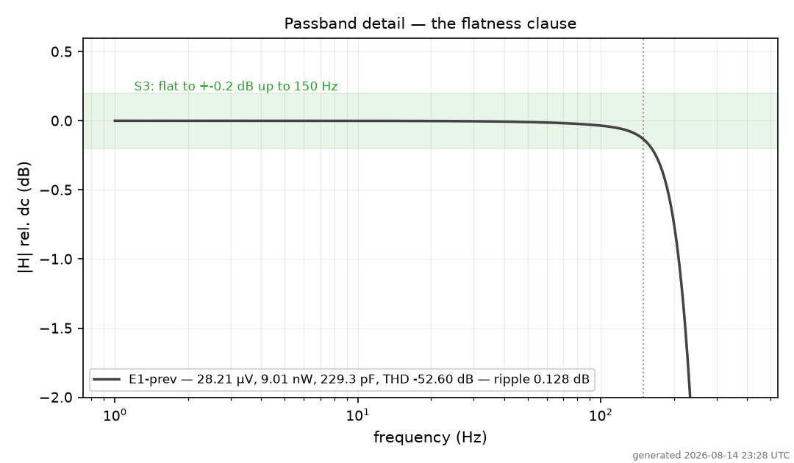
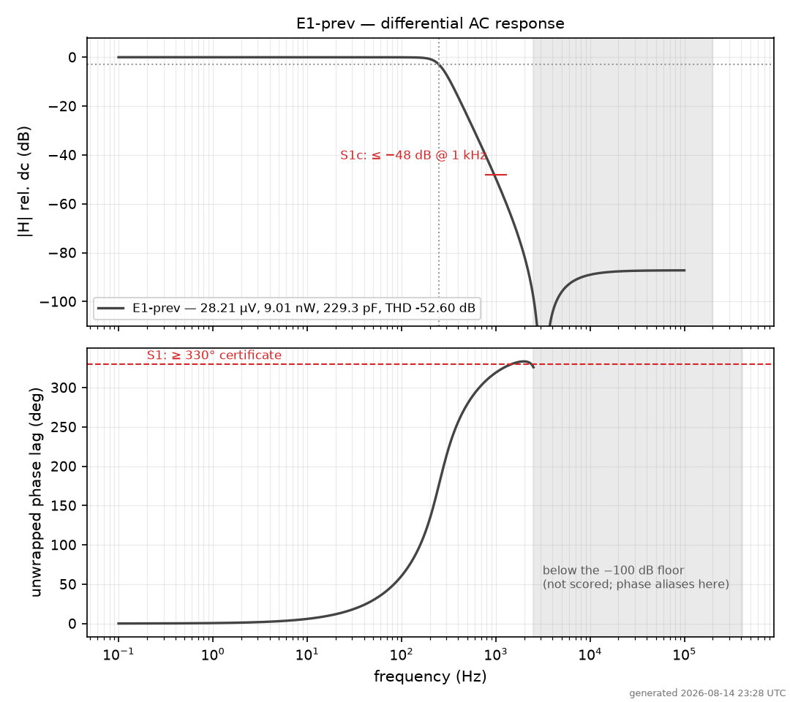
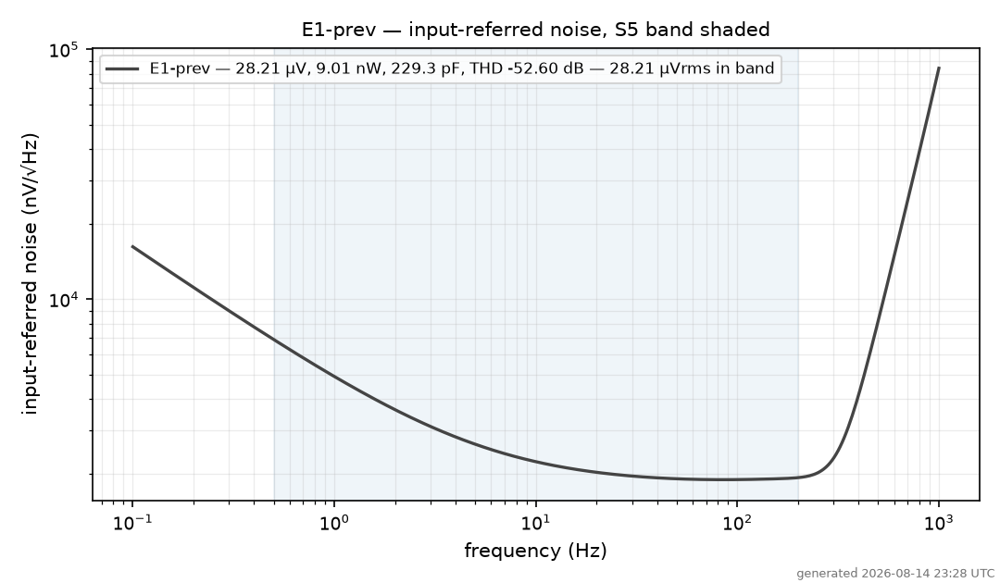

# `E1-prev`

**Superseded by E-combo (better on all four axes). Kept as the single-lever reference: lv gm_f,b only, no gm_f,a change.**

Sizing from round `reuse/cp_0p16_4`. Same topology as every other candidate (branch-stacked SSF, bridge and current reuse intact) — this differs only in device sizes, flavours and capacitor values.

| | |
|---|---|
| input common mode | 0.65 V |
| output common mode | 1.3355 V |
| lv-flavour roles | gmf_b, in_a |

## Spec

| line | requirement | measured | |
|---|---|---|---|
| S1 phase | ph_max ≥ 330° | **333.30°** | PASS |
| S1 stopband | |H|@1 kHz ≤ −48 dB | **-49.55 dB** | PASS |
| S2 cutoff | fc 245–255 Hz | **250.00 Hz** | PASS |
| S3 dc | |dc| ≤ 0.2 dB | **-0.0134 dB** | PASS |
| S3 flatness | ripple ≤ 0.2 dB | **0.1119 dB** | PASS |
| S4 peaking | peak ≤ 0.2 dB | **+0.0000 dB** | PASS |
| S5 irn | IRN < 40 µVrms | **28.21 µV** | PASS |
| S6 power | P < 50 nW | **9.01 nW** | PASS |
| S7 thd | THD ≤ −40 dB | **-52.60 dB** | PASS |

`mono_db` = **0.0000 dB** — the worst *rise* of |H| below the corner; 0 means the response never climbs. Total drawn capacitance **229.3 pF** (reported, never specced).

**All nine lines: PASS.**

## Plots

### Passband — the flatness claim, by eye



### AC response — magnitude and phase



### Input-referred noise density



<!-- robustness-dynamics:begin -->
## Robustness & dynamics

Nominal (mos_tt, 27 C, VDD 1.5 V): fc 250.00 Hz - dc -0.0134 dB - group delay tau(0) 1.641 ms, tau_max 2.431 ms (at-fc 2.319 ms)

| artifact | what |
|---|---|
| [`op_lpf_core_E1.md`](op_lpf_core_E1.md) | measured operating point: per-device ID, gm/ID, gm/gds, **Vds, Vdsat** and saturation margin; the same numbers are stamped on the schematic sheet |
| [`mc.md`](mc.md) | mismatch Monte-Carlo, n = 100: all-pass yield **96.0 %**, with per-line yields and sigmas for fc, dc gain and **group delay** |
| [`pvt.md`](pvt.md) | PVT screen (ss/ff/sf/fs x -40/27/125 C x 1.35/1.5/1.65 V): **2/22 corners clean** — the family's documented supply sensitivity |
| `asbuilt/core_tb_gd.sp` | runnable single-file group-delay bench (tau computed in-deck) — drawn as [`lpf_tb_E1_gd.sch`](lpf_tb_E1_gd.sch) |
| `asbuilt/core_tb_mc.sp` | runnable single-seed mismatch sample (edit `.option seed=`) — drawn as [`lpf_tb_E1_mc.sch`](lpf_tb_E1_mc.sch) |

The core schematic [`lpf_core_E1.sch`](lpf_core_E1.sch) carries the op
annotation on-sheet (render: `lpf_core_E1.png`).
<!-- robustness-dynamics:end -->

## Files

| file | what |
|---|---|
| `design.json` | the sizing of record |
| `asbuilt/core.sp` | certified subckt — the sizing source of truth |
| `asbuilt/core_tb_acnoise.sp` | certified op + ac + noise deck |
| `asbuilt/core_tb_thd.sp` | certified coherent-strobed THD deck |
| `lpf_core_E1.sch` / `.sym` | the schematic and its symbol |
| `lpf_tb_E1.sch` | testbench: op + ac + noise, `.control` on the sheet |
| `lpf_tb_E1_thd.sch` | testbench: transient for S7 |
| `scorecard.json` | the measured numbers + per-line pass/fail |

## Run it

```bash
docker run --rm -it -v "$PWD/signoff/E1-prev:/sch" -w /sch \
    spicexplorer-spice-base:local xschem --rcfile /sch/xschemrc lpf_tb_E1.sch

# or re-run both gates headless
uv run python scripts/draw_xschem.py check signoff/E1-prev/asbuilt/core.sp \
    signoff/E1-prev --name lpf_core_E1
uv run python scripts/draw_xschem.py sim signoff/E1-prev/asbuilt/core.sp \
    signoff/E1-prev --name lpf_core_E1 --design signoff/E1-prev/design.json
```

Both gates currently **PASS**: the schematic netlists to the as-built netlist, and that netlist simulates to the numbers above.

See [`../COMPARISON.md`](../COMPARISON.md) for how this cell compares.
