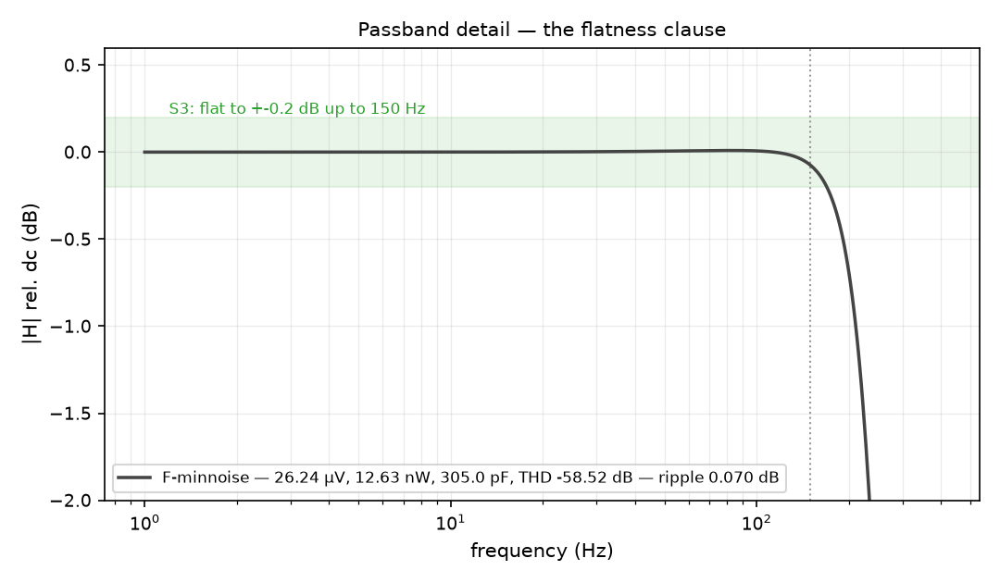
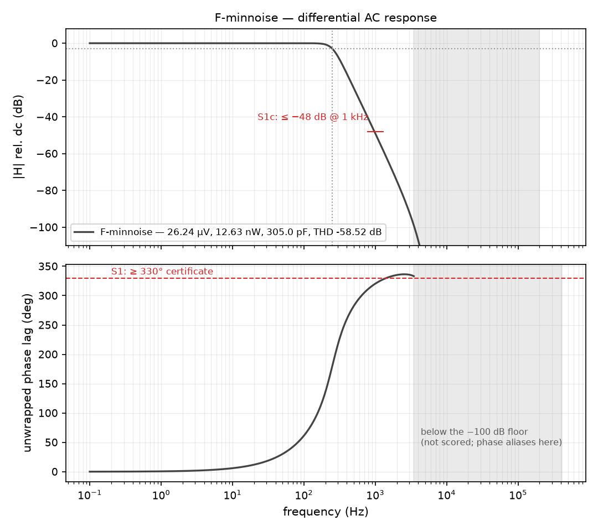
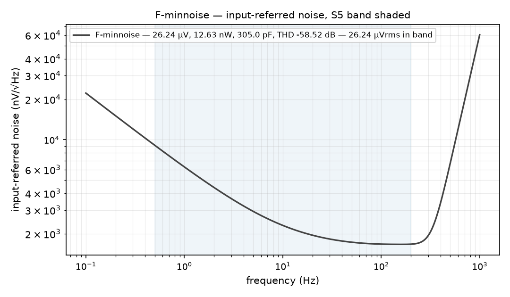

# `F-minnoise`

**Lowest noise in the repo: 26.24 uV, still -58.52 dB THD, for 12.63 nW and 305.0 pF.**

Sizing from round `combo/cb_0p3_0p25_4`. Same topology as every other candidate (branch-stacked SSF, bridge and current reuse intact) — this differs only in device sizes, flavours and capacitor values.

| | |
|---|---|
| input common mode | 0.32 V |
| output common mode | 1.3564 V |
| lv-flavour roles | gmf_b |

## Spec

| line | requirement | measured | |
|---|---|---|---|
| S1 phase | ph_max ≥ 330° | **336.41°** | PASS |
| S1 stopband | |H|@1 kHz ≤ −48 dB | **-48.99 dB** | PASS |
| S2 cutoff | fc 245–255 Hz | **249.95 Hz** | PASS |
| S3 dc | |dc| ≤ 0.2 dB | **-0.0327 dB** | PASS |
| S3 flatness | ripple ≤ 0.2 dB | **0.0546 dB** | PASS |
| S4 peaking | peak ≤ 0.2 dB | **+0.0093 dB** | PASS |
| S5 irn | IRN < 40 µVrms | **26.24 µV** | PASS |
| S6 power | P < 50 nW | **12.63 nW** | PASS |
| S7 thd | THD ≤ −40 dB | **-58.52 dB** | PASS |

`mono_db` = **0.0093 dB** — the worst *rise* of |H| below the corner; 0 means the response never climbs. Total drawn capacitance **305.0 pF** (reported, never specced).

**All nine lines: PASS.**

## Plots

### Passband — the flatness claim, by eye



### AC response — magnitude and phase



### Input-referred noise density



## Files

| file | what |
|---|---|
| `design.json` | the sizing of record |
| `asbuilt/core.sp` | certified subckt — the sizing source of truth |
| `asbuilt/core_tb_acnoise.sp` | certified op + ac + noise deck |
| `asbuilt/core_tb_thd.sp` | certified coherent-strobed THD deck |
| `lpf_core_F.sch` / `.sym` | the schematic and its symbol |
| `lpf_tb_F.sch` | testbench: op + ac + noise, `.control` on the sheet |
| `lpf_tb_F_thd.sch` | testbench: transient for S7 |
| `scorecard.json` | the measured numbers + per-line pass/fail |

## Run it

```bash
docker run --rm -it -v "$PWD/signoff/F-minnoise:/sch" -w /sch \
    spicexplorer-spice-base:local xschem --rcfile /sch/xschemrc lpf_tb_F.sch

# or re-run both gates headless
uv run python scripts/draw_xschem.py check signoff/F-minnoise/asbuilt/core.sp \
    signoff/F-minnoise --name lpf_core_F
uv run python scripts/draw_xschem.py sim signoff/F-minnoise/asbuilt/core.sp \
    signoff/F-minnoise --name lpf_core_F --design signoff/F-minnoise/design.json
```

Both gates currently **PASS**: the schematic netlists to the as-built netlist, and that netlist simulates to the numbers above.

See [`../COMPARISON.md`](../COMPARISON.md) for how this cell compares.
