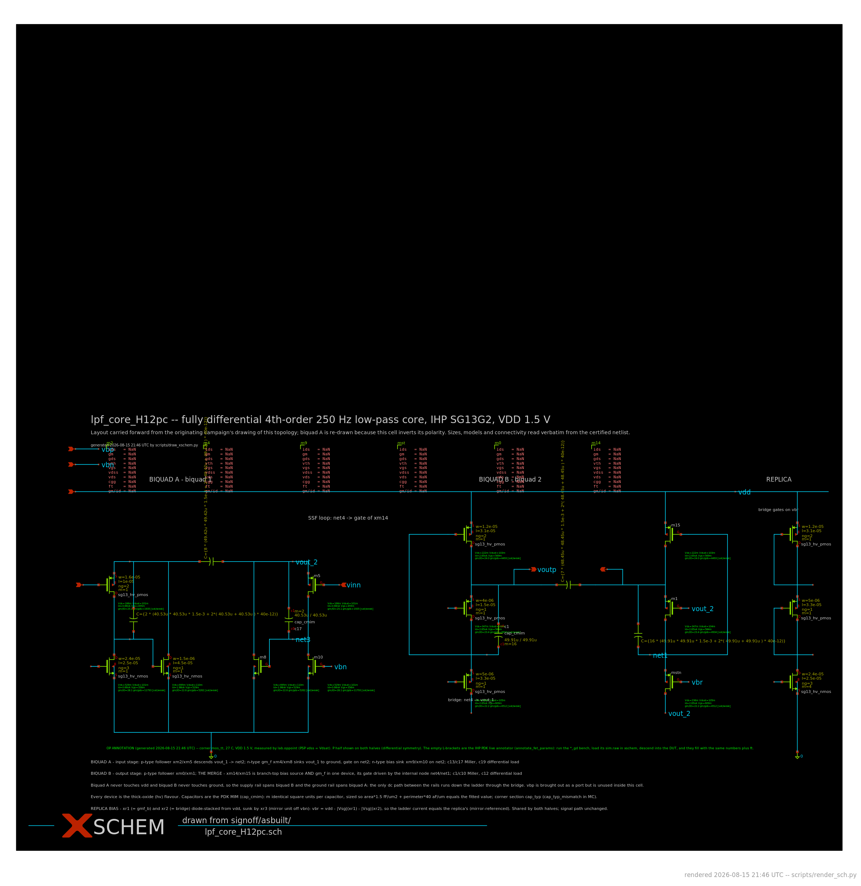
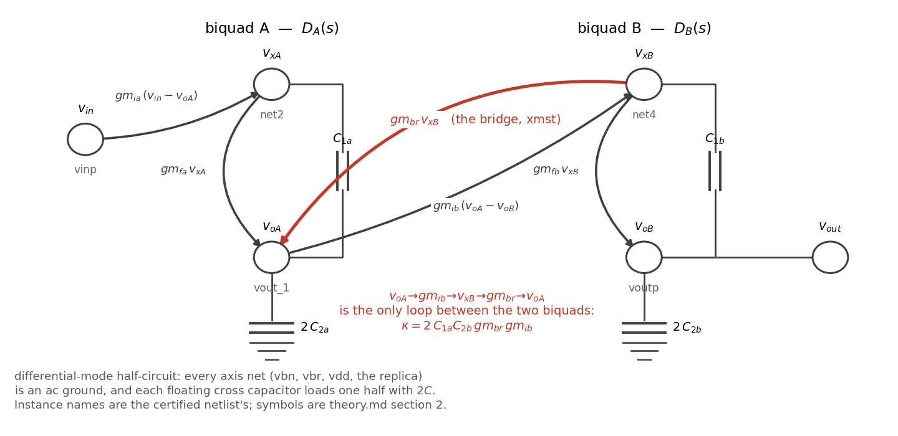

# theory.md — the equations, and their derivations

**[REFERENCE]** — hand-written; the derivations below are symbolic and do not change when
the data is re-extracted.  Every number that *does* change is in
[validation.md](validation.md), which is generated.  The map from the reviewer's request
to these sections is [README.md](README.md).

Four equations are derived here, in the order they depend on each other:

| § | equation | what it is used for |
|---|---|---|
| [2](#2-the-transfer-function) | `H(s)` — exact, symbolic, 4th order | poles, zeros, per-biquad `f₀` and `Q` |
| [3](#3-the-noise-equation) | `S_out = Σ_k \|Z_T,k\|²·S_i,k` | IRN and the per-device noise budget |
| [4](#4-the-distortion-equation) | `HD3(ω)` from the exponential device law | THD, and the amplitude/frequency laws |
| [5](#5-imd3-and-iip3) | `IMD3`, `IIP3` and the memoryless identity | two-tone linearity, and why the identity fails here |

§3 and §4 share `Z_T,k`, the transimpedance from device *k*'s drain–source port to the
differential output.  A device's noise current and its distortion current are injected at
the same port, so the same transimpedance propagates both.  Establishing `Z_T,k` once,
from the data, is what makes the distortion equation a prediction rather than a fit.

---

## 1. The object, and the two reductions that make it tractable

### 1.1 The cell

A fully differential 4th-order low-pass filter: **two super-source-follower (SSF) biquads
in cascade, stacked so that biquad B's bias current is reused as biquad A's output
current**, with a shared three-device replica generating the bridge gate bias `vbr`.
(The reviewer's reading of the topology — a PMOS super-source-follower with current reuse
of a cascoded PMOS flipped-voltage-follower — describes the same circuit from the device
side; no action was requested and none is taken.)

**The drawing of record.**  The cell's xschem schematic is committed, and every symbol
below is bound to a device on it:



*`signoff/post-pvt/H12-pdk-cap/lpf_core_H12pc.png` — the pre-layout DUT of record,
rendered from `lpf_core_H12pc.sch` by `scripts/render_sch.py`.  Sizes, models and
connectivity are read verbatim from the certified netlist; the drawing shows biquad A on
the left, biquad B in the middle and the three-device replica on the right.*

Reading the equations against that drawing:

| instance | role | equation symbol | connection (this half) |
|---|---|---|---|
| `xm2` (`xm5`) | biquad-A input follower | `gm_ia` | g = `vinp`, s = `vout_1`, d = `net2` |
| `xm4` (`xm8`) | biquad-A shunt feedback | `gm_fa` | g = `net2`, d = `vout_1`, s = 0 |
| `xm9` (`xm10`) | biquad-A internal bias sink | — (absent from `H(s)`) | g = `vbn`, d = `net2`, s = 0 |
| `xmst` (`xmstn`) | **the current-reuse bridge** | `gm_br` | g = `vbr`, s = `net4`, d = `vout_1` |
| `xm0` (`xm1`) | biquad-B input follower | `gm_ib` | g = `vout_1`, s = `voutp`, d = `net4` |
| `xm14` (`xm15`) | biquad-B shunt feedback | `gm_fb` | g = `net4`, d = `voutp`, s = `vdd` |
| `xc13` (`xc17`) | biquad-A Miller cap | `C1a` | `net2` — `vout_1` |
| `xc19` | biquad-A load, floating | `C2a` (→ `2·C2a`) | `vout_1` — `vout_2` |
| `xc1` (`xc10`) | biquad-B Miller cap | `C1b` | `voutp` — `net4` |
| `xc12` | biquad-B load, floating | `C2b` (→ `2·C2b`) | `voutp` — `voutn` |
| `xr1`, `xr2`, `xr3` | replica generating `vbr` | — (an ac ground) | shared by both halves |

Two devices are absent from that table, for different reasons.  The **bias sinks**
(`xm9`/`xm10`) are absent from `H(s)` because an ideal current source is an open circuit
to small signals — yet they carry **38.9 % of the IRN power** (validation.md §5.2),
against 39.8 % for the input follower and less for every other device, because they inject
their current at `net2`, a signal node.  The **replica** is absent from both: it sits on
the differential axis, so its noise is rejected with its signal (4.5·10⁻¹¹ % of the IRN
power).  "Not in the transfer function" and "not in the noise" are different statements.

Two structural facts set up the algebra below:

* **The bridge `xmst` is the current-reuse element.**  Its source is biquad B's internal
  node `net4`, its drain is biquad A's output `vout_1`, and its gate is on the replica
  rail.  Small-signal it is a common-gate device: it adds a transconductance at `net4`
  alongside `gmf_b`, and injects `gm_br·v_net4` into `vout_1`.  That injection is a path
  from biquad B into biquad A, and §2.3 identifies it as the term that stops `H(s)` from
  being a product of two independent biquads.
* **`C2a` and `C2b` are drawn as single floating capacitors between the two halves.**
  Under differential excitation the far plate moves by exactly `−v`, so each half is loaded
  by `2·C2` to the virtual ground.  Every `2` in the algebra below is this factor, and it is
  why the drawn farads are half what a single-ended realisation would need.

### 1.2 Reduction 1 — the differential-mode half-circuit, and why it is exact here

Under a differential excitation `vinp = +½`, `vinn = −½`, every net on the symmetry axis
(`vbn`, `vbr`, `rep_x`, `vdd`, and the replica's internal nodes) is a virtual ground, and
the two halves carry equal and opposite signals.  This is **not an approximation for this
cell**: the two halves are drawn from the same device list with identical sizes, so the
system matrix is exactly symmetric under the half-swap permutation, and the differential
eigenspace is invariant.

The half-circuit, drawn as the branches the algebra contains:



*`figures/half_circuit.png` (`scripts/figures.py::fig_half_circuit`).  The same cell as the
schematic above, reduced to one half and to its small-signal branches, with each branch
labelled by the symbol it carries into §2.  The red branch is the bridge — the only path
between the two biquads, and the reason `κ ≠ 0`.*

The reduction is discharged numerically rather than asserted: the half-circuit's `H(s)` is
compared against the **full 13-node differential solve** at the same operating point and
against the ac sweep, and gives identical poles, identical dc gain and the same residual
against simulation ([validation.md §2–3](validation.md#2-the-transfer-function-evaluated)).
The half-circuit is used only where a symbolic answer is wanted; every reported pole, zero
and transimpedance comes from the full differential system.

### 1.3 Reduction 2 — the small-signal model, and the four things weak inversion changes

Each MOS becomes `gm`, `gmb`, `ro`, `cgs`, `cgd`, `cdb`, `csb`.  Four bindings are specific
to this cell and each is asserted in code (`scripts/n2tf_model.py::bind_op` refuses the
netlist if any fails):

| binding | why |
|---|---|
| `gmb = 0` | every device has bulk tied to source, so `v_bs ≡ 0` |
| `csb = 0` | source and bulk are the same node; the capacitor is shorted out |
| `cgs ← cgs + cgb` | **in weak inversion there is no channel**, so the PSP `cgb` op-var carries essentially all of `cgg`; with bulk at the source it lands gate-to-source |
| `cdb ← cdb + cjd` | intrinsic drain–bulk plus the drain junction |

The third binding is the one that changes the numbers: measured on the biquad-A input
follower, `cgg` = 250.5 fF, of which **`cgb` = 247.4 fF and `cgs` = 3.1 fF**.  Taking `cgs`
as the gate-to-source capacitance and leaving `cgb` on the bulk, as a strong-inversion
reading would, puts **81× too little** capacitance on the node.  In weak inversion there is
no inversion layer to terminate the gate field, so the charge lands on the bulk; bulk is
the source here, so the capacitance is gate-to-source.  [validation.md §2.2](validation.md#22-reconciling-the-three-pole-estimates--closed-form-full-model-simulation)
shows this one capacitance accounts for the 2 % gap between the design equation and the
simulator, and for both out-of-band zero pairs.

---

## 2. The transfer function

### 2.1 The construction

With the small-signal model in place, the half-circuit's MNA system is *exactly* a linear
matrix pencil in `s`:

```
    Y(s)·v = b ,        Y(s) = G + s·C
```

`G` collects conductances and controlled sources (`gm`, `1/ro`), `C` collects capacitances,
and `b` is the excitation.  No approximation has been made yet: `Y(s)` is affine in `s`
because every element is either a conductance or a capacitance.

The transfer function follows by Cramer's rule on the reduced (grounded-node-removed)
system, which is what `spicexplorer_netlist2tf.extract_tf` computes symbolically:

```
    H(s)  =  V_out(s)/V_in(s)  =  det M(s) / det Y_rr(s)
```

with `M(s)` the bordered pencil that replaces the output column by the input injection.
For the 5-node half-circuit the symbolic determinant is tractable; for the full 13-node
differential cell it is not, so the poles and zeros are taken instead as the finite
generalised eigenvalues of `(−G_rr, C_rr)` and of the bordered pencil respectively
(`scripts/pencil.py`).  **The two routes are the same algebra**, one solved in symbols and
one in floating point; §3 of validation.md checks them against each other and against the
simulator.

### 2.2 The result

At `Fidelity.IDEAL` — transconductances and the four design capacitors, no device
parasitics — the exact result is

```
                       gm_fa · gm_ia · gm_ib · (gm_br + gm_fb)
    H(s)  =  ─────────────────────────────────────────────────────────
                  a₄·s⁴ + a₃·s³ + a₂·s² + a₁·s + a₀   ≡   D(s)
```

with the denominator coefficients in full, nothing elided:

```
  a₄ = 4·C1a·C1b·C2a·C2b

  a₃ = 2·C1a·( C1b·C2a·gm_br + C1b·C2a·gm_fb + C1b·C2b·gm_fa + 2·C2a·C2b·gm_br )

  a₂ = C1a·C1b·gm_fa·(gm_br + gm_fb)
     + 2·C1a·C2a·gm_ib·(gm_br + gm_fb)
     + 2·C1a·C2b·gm_br·(gm_fa + gm_ib)
     + 2·C1b·C2b·gm_fa·gm_ia

  a₁ = gm_fa·( C1a·gm_ib·(gm_br + gm_fb) + C1b·gm_ia·(gm_br + gm_fb) + 2·C2b·gm_br·gm_ia )

  a₀ = gm_fa·gm_ia·gm_ib·(gm_br + gm_fb)
```

Printed verbatim by `scripts/tf_analysis.py` into `data/tf.json` (`symbolic.quartic_coeffs`,
and `symbolic.h_latex` for the LaTeX form).  Grouped as written above, `gm_br` and `gm_fb`
appear as a sum in most terms — the bridge acts as extra shunt feedback for biquad B — and
the terms where `gm_br` appears alone are what the current reuse adds.  Making that precise:

The denominator factors **exactly** — this is a symbolic identity, verified by
`sympy.expand(D − (D_A·D_B + κ·s²)) == 0` in `scripts/tf_analysis.py::symbolic_form`,
which raises if the residual is nonzero:

```
    D(s)  =  D_A(s) · D_B(s)  +  κ · s²

    D_A(s) =  2·C1a·C2a·s²  +  C1a·gm_fa·s  +  gm_fa·gm_ia
    D_B(s) =  2·C1b·C2b·s²  +  [C1b·(gm_br + gm_fb) + 2·C2b·gm_br]·s  +  gm_ib·(gm_br + gm_fb)
    κ      =  2·C1a·C2b·gm_br·gm_ib
```

**Reading the three pieces.**

* `D_A` is the standard SSF biquad denominator.  Dividing through by `gm_fa·gm_ia`,

  ```
      D_A/(gm_fa·gm_ia)  =  1 + s·C1a/gm_ia + s²·C1a·(2·C2a)/(gm_ia·gm_fa)
  ```

  which is the validated single-biquad model of `doc/design-reference.md` §3 with its
  single-ended load `C2_single = 2·C2a`.  The two derivations were done independently and
  agree symbol for symbol, which is one of the checks.
* `D_B` is the same biquad with the **two changes the current reuse makes**:
  1. the bridge's transconductance **adds** to the shunt-feedback device, `gm_fb → gm_fb + gm_br`,
     because both devices terminate `net4` against an ac ground; and
  2. the bridge contributes an **extra damping term** `2·C2b·gm_br` on the `s` coefficient,
     because the bridge's own source node carries the output capacitance.
* `κ·s²` is the term the current reuse introduces, and it is the red branch of the
  half-circuit figure in §1.2.  It is the only term coupling the two biquads, and its
  factors name the loop: `gm_ib` (B's follower senses A's output), `gm_br` (the bridge
  feeds B's internal node back into A's output), `C1a` and `C2b` (the two capacitors the
  loop closes through).  Set `gm_br → 0` and `κ = 0`, `D_B` becomes an SSF biquad, `a₀`
  becomes `gm_fa·gm_ia·gm_ib·gm_fb`, and `H(s)` is the product of two independent
  second-order sections.  The bridge is the only difference between two cascaded biquads
  and this filter.

**The numerator, and why the dc gain is structural.**  The numerator is
`gm_fa·gm_ia·gm_ib·(gm_br + gm_fb)`, which is the constant term of `D_A·D_B`
(and `κ·s²` has no constant term).  Therefore

```
    H(0) = 1  exactly, for any sizing.
```

The passband gain is set by the topology, not by the sizing, so the `|dc| ≤ 0.2 dB` clause
is met by construction rather than by a knob.  At `Fidelity.FULL` the finite `ro` of the
followers moves it to −0.0081 dB, and nothing else does.

### 2.3 Per-biquad `f₀` and `Q` — and which Q the reviewer should be given

Each factor is a standard second-order denominator `a·s² + b·s + c`, so
`ω₀ = √(c/a)` and `Q = √(a·c)/b`:

```
                gm_fa · gm_ia                                    ⎡ 2·C2a · gm_ia ⎤
    ω₀,A²  =  ─────────────── ,          Q_A  =  sqrt ⎢ ───────────── ⎥
               2·C1a · C2a                                       ⎣ C1a  · gm_fa  ⎦

               gm_ib · (gm_br + gm_fb)                sqrt[ 2·C1b·C2b·gm_ib·(gm_br + gm_fb) ]
    ω₀,B²  =  ───────────────────────,     Q_B  =  ───────────────────────────────────────────
                    2·C1b · C2b                       C1b·(gm_br + gm_fb)  +  2·C2b·gm_br
```

`Q_A` is the standard SSF result — a *capacitance ratio* at fixed devices, so the filter's
shape can be tuned at constant power.  `Q_B` is not: the bridge appears in the numerator
through `gm_br + gm_fb` under a square root, and again, alone and linearly, in the
denominator's `2·C2b·gm_br` term.  Differentiating, `∂Q_B/∂gm_br < 0` for every positive
parameter set, since the square root grows more slowly than the linear term, so **raising
the bridge's transconductance strictly lowers `Q_B`**.  The current reuse therefore trades
part of biquad B's Q for its power saving, and the closed form gives the sign of that
trade directly.

**Which Q to quote.**  These two are the Q's of the **isolated stages** (`κ = 0`).  At the
measured operating point they are **2.10 and 0.46** — and they are *not* the filter's Q's,
because `κ` is 11.78 % of the quartic's own `s²` coefficient, too large to neglect.  The
filter's pole pairs, from the roots of the full quartic `D_A·D_B + κ·s²`, are

```
    pair A:  f₀ = 249.72 Hz,  Q = 0.5430          pair B:  f₀ = 251.08 Hz,  Q = 1.3074
```

i.e. essentially a **4th-order Butterworth** (Q's 0.5412 / 1.3066), realised by two
frequency-coincident pole pairs with different damping.  The answer to *"the quality factor
of each biquad"* is therefore given in both forms:

| | biquad A | biquad B | meaning |
|---|---|---|---|
| isolated-stage Q (`κ = 0`) | 2.10 | 0.46 | what each section would do on its own |
| **filter pole-pair Q** | **0.543** | **1.307** | what the cascade actually realises |

**Sizing implication.**  Sizing the two sections independently to Q = 0.54 and 1.31 and
then stacking them does not give a Butterworth response; the stacking maps (2.10, 0.46)
onto (0.543, 1.307).  That mapping is `κ`.

### 2.4 Zeros

At `Fidelity.IDEAL` the numerator is a constant: the design capacitors alone produce **no
finite zeros**, and the response is all-pole.  Finite zeros appear only when device
capacitance is added, because a source follower's gate-to-source capacitance is a direct
feed-forward path from its input to its output.  The measured result — two complex pairs
at 3.85 kHz and 5.05 kHz, and their disappearance when `cgs` is zeroed while `cgd` changes
nothing — is in
[validation.md §2.2 and §4](validation.md#4-poles-and-zeros--the-map).  Both are more than
15× above the pole frequency and neither affects the passband or the 1 kHz stopband number.

---

## 3. The noise equation

### 3.1 Derivation

A noise source is a current generator `i_k` across a device port `(p, q)`.  Because the
system is linear, superposition applies exactly, and the output voltage produced by that
generator alone is

```
    v_out,k(jω)  =  Z_T,k(jω) · i_k ,       Z_T,k(jω) ≡ V_out(jω) / I_inj at port (p,q)
```

`Z_T,k` is obtained from the *same* pencil `Y(s) = G + s·C`: drive `+1 A` into node `p` and
`−1 A` out of node `q`, ground the input port, solve, and read the differential output.
That is one linear solve per port per frequency, and it is what
`spicexplorer_netlist2tf.transimpedance` computes.

Distinct generators are uncorrelated (they are independent physical processes in distinct
devices, or distinct mechanisms in one device), so their **powers** add:

```
    S_out(f)  =  Σ_k  |Z_T,k(j2πf)|² · S_i,k(f)                                     (N1)
```

and, referring to the input through the filter's own response and integrating over the
sign-off band,

```
    IRN²  =  ∫[0.5, 200] S_out(f) / |H(j2πf)|²  df                                  (N2)
```

`(N1)` is the noise equation the reviewer asked for.  It contains no fitted quantity:
`S_i,k(f)` is the simulator's own per-generator noise vector and `Z_T,k` is a solve on the
operating-point-bound matrices.

### 3.2 What the generators are, in this bias regime

For a MOS in weak inversion and saturation the channel current is a sequence of
independent barrier-crossing events, so the channel generator is **shot noise**:

```
    S_id  =  2·q·I_D          (equivalently  2·n·kT·gm,  since gm = I_D/(n·U_T))
```

not the strong-inversion `4kT·γ·gm` with γ = ⅔.  The two forms differ in both magnitude and
bias dependence, and [validation.md §5.3](validation.md#53-are-the-generators-what-they-claim-to-be)
shows the data selecting the shot-noise form (`S_i/2qI_D` = 0.87–1.04, and the `gm`-referred
column differing from it by exactly `n/2` as it must).  Flicker noise adds
`S_flicker ∝ 1/f^(1+δ)` at the gate.

**Reading `S_id` off the simulator takes two generators, not one.**  The compact model does
not report the channel as a single number: it splits it by the correlation `c` between the
channel noise and the induced gate noise, reporting `(1 − c²)·S_id` under the name `idid`
and injecting the remaining `c²·S_id` drain-to-source through an internal noise node, where
it is reported as `igig`.  Both are the same physical generator at the same port, and only
their sum is `2qI_D`; `idid` on its own is about 0.7 of it, with `c` = 0.53–0.55 measured
here.  Together they are **89 % of the total IRN power**, against 11 % for flicker.  A hand
model that takes `idid` for the channel and stops there reports IRN 1.4 dB below the
simulated value; one that writes `S_id = 2qI_D` needs no second term.

**There is no gate-leakage noise in this cell.**  The name `igig` invites the opposite
reading, and an earlier revision of this pack took it — the model's gate-leakage generators
are `igs` and `igd`, and on these thick-oxide devices both are identically zero, because
the PDK card sets every gate-current pre-factor to zero and a probe device draws no gate
current at all at this bias (`scripts/gate_leakage_probe.py`).

### 3.3 Which port each generator belongs to — established, not assumed

`(N1)` is only meaningful if each `S_i,k` is paired with the right `Z_T,k`.  Rather than
assume the pairing, it is **selected from the data**: for each generator, every candidate
device port is tried, and the one whose implied `S_i = S_out/|Z_T,port|²` best matches the
expected spectral shape (frequency-flat for a white generator, `1/f` for flicker) is taken,
with the full ranking and the margin over the second-ranked port recorded
(`scripts/noise_analysis.py::identify_port`).  Both channel generators select drain–source,
`igig` included — which is the measurement that identified it as a channel generator in the
first place.

The same result is used in §4: the distortion current is injected at the same port, so
**the same `Z_T,k` propagates it**, and the distortion equation has no free parameters.

### 3.4 The closure that makes it a proof rather than a plausibility argument

`(N1)` is checked three ways, all in
[validation.md §5.1](validation.md#51-closure):

1. `Σ_k |Z_T,k|²·S_i,k` reproduces the simulator's own total output noise to 2·10⁻⁷ % **at
   every frequency** — so no generator is missing, none double-counted, and the `Σ` is
   complete.
2. `(N2)` reproduces the certified sign-off IRN exactly, using the frozen `lab.metrics`
   integrator rather than a re-derivation.
3. `spicexplorer_netlist2tf.transimpedance` and the independent matrix-pencil solve agree
   to ~10⁻⁸ relative — two implementations of `Z_T` rather than one.

---

## 4. The distortion equation

### 4.1 Generation: what an exponential device emits

Every device is below threshold (validation.md §1), so

```
    I_D  =  I_S · exp( v_GS / (n·U_T) ) ,      n = 1/((gm/I_D)·U_T),   U_T = kT/q
```

With a sinusoidal gate–source excursion `v_gs(t) = V_e·cos ωt`, define the **modulation
index**

```
    a  =  V_e / (n·U_T)
```

and use the Jacobi–Anger expansion of the exponential in modified Bessel functions:

```
    exp(a·cos ωt)  =  I₀(a)  +  2·Σ_{k≥1} I_k(a)·cos(k·ωt)
```

The dc term of the drain current is `I_S·I₀(a)`, which is *what a dc measurement of `I_D`
already reports*.  Dividing through, the k-th harmonic current is

```
    i_k  =  I_D · 2·I_k(a) / I₀(a)          →      i₃ ≈ I_D·a³/24 ,  i₂ ≈ I_D·a²/4   (a ≪ 1)
```

The code uses the exact Bessel ratio, not the truncation: the two agree to 1 % below
a ≈ 0.3 and diverge above it, and the frequency sweep goes above it.

**`a` is not a free parameter.**  `n` comes from the measured `gm/I_D`, and `V_e` is read
from the small-signal model at the drive amplitude: it is the follower's own gate-to-source
excursion, which the shunt feedback reduces and makes frequency dependent.  Nothing in the
distortion equation is fitted.

### 4.2 Propagation: the same `Z_T` as the noise

`i₃,k` appears across device *k*'s drain–source port — the port §3.3 established from the
data — so it reaches the output through the same transimpedance, evaluated at the third
harmonic:

```
    HD3(ω)  =  | Σ_k  Z_T,k(j3ω) · I_D,k · 2·I₃(a_k(ω))/I₀(a_k(ω)) |  /  |V_out,fund(ω)|   (D1)
```

Two details in evaluating the sum:

* **The sum is coherent, and it runs over both halves.**  Under differential drive the two
  halves' gate excursions are opposite *and* their transimpedances to the differential
  output are opposite; the two sign flips cancel, so the N-half device adds **in phase**
  with its P-half counterpart, not against it.  Summing only one half under-predicts HD3 by
  about 21 dB — a mistake made and caught during this work.
* **Each term carries the phase `exp(3j·arg v_gs)`.**  The devices' `v_gs` phasors are not
  aligned (the internal nodes lag the outputs), so the terms partially cancel.  `(D1)` is
  reported alongside a worst-case `Σ|·|` bound so the size of that cancellation is visible.

### 4.3 The two laws `(D1)` predicts, and their scope

**Amplitude.**  At fixed ω, `a ∝ A` and the fundamental is linear in `A`, so
`HD3 ∝ a³/A ∝ A²` — **40 dB/decade**.  Measured: 42.63 dB/decade with a 0.51 dB worst
residual over the three drives inside the model's window
([validation.md §6.1](validation.md#61-hd3-versus-amplitude--the-a²-law)).
`THD ≈ HD3` over the band, because HD2 is 25–50 dB below HD3 — the differential topology
cancels even-order terms, and the residual HD2 is mismatch-free simulation, i.e. numerical.

**Frequency.**  A follower's own `v_gs` is the *error* of the follower:
`v_gs = v_in − v_out ∝ (1 − H(jω))·v_in`, and at low frequency `|1 − H| → ω·C1/gm_i`.  So
`V_e ∝ ω`, `a³` gives `ω³`, and the falling `|Z_T(j3ω)|` removes one power of ω — the
**`HD3 ∝ ω²`, 40 dB/decade** asymptote.  That asymptote needs `3ω ≪ ω₀`, which at
f_in = 50 Hz is violated (3ω sits at 0.6·f_c); `(D1)` keeps `|1 − H(jω)|` and `Z_T(j3ω)`
exactly and is steeper than the asymptote near the corner.

**Stated scope.**  `(D1)` is a weak-inversion, small-`a`, quasi-static, linear-propagation
model.  Measured against simulation at 43.75 mVpp it holds to **±2 dB over 35–65 Hz**.
Below that band an additive residual of 0.18–0.28 µV dominates: it is constant in volts
while the model's own prediction moves 32 dB, so it comes from a mechanism `(D1)` does not
contain.  Above ~100 Hz `a` exceeds 0.3 and the propagation stops being linear.  Every
claim made from `(D1)` in this pack is made inside that window; the full error table is
[validation.md §6.2](validation.md#62-hd3-versus-frequency--the-ω²-law-and-where-the-model-stops).

---

### 4.4 A second generation mechanism: drain-conductance curvature

`(D1)` generates harmonics at the GATE: the exponential turns a `v_gs` swing into harmonic
current.  It is not the only nonlinearity a device has.  The same device also sources a
current that depends on its DRAIN voltage, and that dependence is not linear either.
Expanding `I_D` about the operating point in `v_ds` alone,

```
I_D(v_ds) = I₀ + g₁·v_ds + g₂·v_ds²/2 + g₃·v_ds³/6 + …          (D4)

    g₁ = g_ds ,     g₂ = ∂g_ds/∂V_DS ,     g₃ = ∂²g_ds/∂V_DS² .
```

The small-signal model keeps `g₁` — it IS `g_ds`, and it is already in the MNA — and drops
everything after it.  Dropping `g₃` is what makes `Z_T` linear, so this mechanism is
invisible to the propagation of §4.2 by construction, not by neglect.

For `v_ds = A·cos(ωt)`, using `cos³θ = (3cosθ + cos3θ)/4`, the cubic term emits a third
harmonic of amplitude

```
i₃,gds = g₃·A³/24 ,     at 3ω, phase 3·arg(v_ds).              (D5)
```

Two things make this cheap to evaluate rather than a new theory. First, `i₃,gds` is a
current injected between the same two terminals — drain and source — that §3.3 established
as a noise generator's port, so it propagates to the output through the SAME `Z_T(j3ω)`
already built and cross-checked there; `(D3)`'s propagation step is reused unchanged.
Second, `A` need not be estimated: the MNA system that produced `H(s)` also produces every
interior node's response, so each device's `v_ds` phasor at the fundamental is read off the
same solve (`pencil.node_response`).

The scaling is what distinguishes this mechanism from `(D1)` in a measurement. `(D1)`'s
third harmonic is driven by the follower's `v_gs`, which is the feedback ERROR and
therefore falls with the loop gain as ω drops; `(D5)` is driven by `v_ds`, which follows
the output SWING and is flat across the passband. So the two mechanisms have opposite
low-frequency behaviour, and a residual that is flat in volts where `(D1)` collapses is
the signature `(D5)` predicts. That is a falsifiable statement and it is tested, with its
threshold fixed in advance, in [validation §10.1](validation.md#101-a-named-mechanism-for-the-residual).

`g₃` is not available from an operating point: PSP reports `g_ds`, not its second
derivative. It is measured per device by sweeping `V_DS` about the device's own bias and
fitting `(D4)` — with the caveat that a Taylor coefficient is only meaningful if it does
not depend on the fit window, which for one device in this cell it does.

## 5. IMD3 and IIP3

### 5.1 The definitions used

Two equal tones at `f₁`, `f₂` (`f₁ < f₂`, spacing `Δ = f₂ − f₁`), each of peak amplitude
`A` at the differential input.  The third-order intermodulation products fall at
`2f₁ − f₂` and `2f₂ − f₁`; `IMD3` is their level relative to one output fundamental, and

```
    IIP3|_dBV  =  A|_dBV  −  IMD3|_dBc / 2                                          (I1)
```

which is the usual 3:1-slope extrapolation, written in dBV because this is a voltage-mode
cell with no reference impedance (§6.3 of validation.md says why no dBm figure is quoted).
`(I1)` holds only where `IMD3` moves at 3 dB/dB; that is tested rather than assumed — the
measured IMD3 slope is 41.7 dB/decade against the theoretical 40, and the IIP3 extrapolated
from each of the three amplitudes inside that range agrees to 0.52 dB.

### 5.2 The memoryless identity, and why it must fail here

For a **memoryless** cubic nonlinearity `y = α₁x + α₃x³`, driven at the same per-tone
amplitude, the third-order products are larger than the single-tone third harmonic by
exactly a factor of 3:

```
    IMD3  =  HD3  +  20·log₁₀ 3  =  HD3 + 9.54 dB                                   (I2)
```

`(I2)` is a *test*, not a prediction, and §4.3 predicts it will fail: `HD3` here rises with
frequency, so the third-order response is not memoryless.  Measured excess: **+6.95 dB**.

Which memory it is can be decided by experiment.  There are two candidates:

* **Envelope (baseband) memory** — the cell's response at the difference frequency `Δ`.
  This would make IMD3 depend on tone spacing.
* **Carrier-frequency dependence** — the third-order response varying with `f`, which is
  the mechanism of §4.3.  This is nearly independent of spacing at fixed centre frequency.

The spacing sweep decides it: over a **15× change in Δ**, IMD3 moves **1.76 dB**
([validation.md §6.4](validation.md#64-is-the-cell-memoryless--the-imd3--hd3--954-db-test)).
Envelope memory is therefore ruled out and the 6.95 dB excess is attributed to carrier
frequency dependence.  The consequence for measurement: **for this cell, HD3 at one
frequency does not predict IMD3 — measure IMD3.**

### 5.3 A measurement constraint that is part of the equation's validity

`IMD3` is read from a DFT of a coherent strobed transient.  Both tones and all four
third-order products must land exactly on DFT bins, which forces the spacing to be an even
multiple of the DFT bin.  An odd spacing puts the tones on half-bins, and the resulting
"IMD3" is spectral leakage rather than distortion — observed once at −0.79 dBc, which is
not a distortion level any circuit produces.  Every two-tone result in this pack uses even
spacings, and every transient carries a rectangular-vs-Hann agreement check for coherence.

---

## 6. Assumptions, and where each one is discharged

| # | assumption | discharged by |
|---|---|---|
| A1 | the DM half-circuit is exact for this cell | identical poles/dc gain/residual against the full 13-node differential solve — validation.md §2–3 |
| A2 | bulk is tied to source on every device (`gmb = 0`, `csb = 0`) | asserted in `n2tf_model.bind_op`, which refuses the netlist otherwise; visible in the `core.sp` device lines |
| A3 | `cgb` folds into `cgs` in weak inversion | measured `cgg` = 250.5 fF, `cgb` = 247.4 fF on the input follower; the ablation of validation.md §2.2 shows this capacitance alone closes the model-to-simulator gap |
| A4 | small-signal linearity for `H(s)`, `Z_T` | 0.027 dB / 0.34° against the ac sweep over the scored band — validation.md §3.1 |
| A5 | noise generators are uncorrelated (powers add) | `Σ_k` closes on the simulator's total to 2·10⁻⁷ % at every frequency — validation.md §5.1 |
| A6 | each generator's port | selected from the data with a recorded ranking and margin — validation.md §5.3 |
| A7 | weak-inversion exponential device law | every device below threshold; and the exponential law's own prediction (40 dB/decade) confirmed at 42.63 — validation.md §1, §6.1 |
| A8 | `(D1)`'s validity window | ±2 dB over 35–65 Hz, with both failure modes named and bounded — validation.md §6.2 |
| A9 | `post_lumped` stands in for the extracted post-layout netlist in the symbolic lane | `fc` within 0.003 Hz and `ph_max` within 0.05° of the certified post-layout scorecard — validation.md §7 |

**One open item**, recorded rather than closed: below ~35 Hz the measured third harmonic
exceeds `(D1)` by an amount that is **constant in volts** — 0.18, 0.21 and 0.28 µV at 10,
20 and 35 Hz, while `(D1)`'s own prediction moves by a factor of 39 over the same span.  An
additive, frequency-independent excess is a different mechanism, not a mis-scaled version
of the modelled one; drain-conductance nonlinearity is the candidate, since a small-signal
`Z_T` linearises it away by construction.  The residual is **61.7 dB below** the third
harmonic the cell produces at the S7 operating point (256 µV at 175 mVpp, 50 Hz), so it is
a modelling gap and not a performance one.  Closing it needs a `g_ds(V_DS)` expansion term
the present model does not have.
